# 深度卷积网络的原理设计：一个简单的SimpNet

[原文链接](https://arxiv.org/pdf/1802.06205.pdf)

作者：

 * Seyyed Hossein Hasanpour 
* Mohammad Rouhani
* Mohsen Fayyaz
* Mohammad Sabokrou 
* Ehsan Adeli

译者：

* 陈晓伟

## 摘要

近年来，卷积神经网络(CNN)获得非常重大的成功，其代表就有VGGNet、ResNet和DenseNet等等，不过这些模型的参数达到了上亿个(几亿到几十亿不等)，这就需要更加关注网络推算所需要的计算资源，以及网络所占用的内存开销。由于这些现实的问题，限制了其在训练和优化的应用。这时，轻量级架构(比如：SqueezeNet)的提出，志在解决以上的问题。不过，要在计算资源和高效运行之间进行权衡，就会碰到精确度不高的问题。网络低效的问题大部分源自于架构的点对点设计。本文在讨论过程中会为构建高效的架构提出几个原则，并会阐述在设计网络结构过程中对于不同方面的考虑。此外，我们还会介绍一个新层——*SAF-pooling*，在加强网络归一化能力的同时，通过选择最好的特征保持网络的简单性。根据这些原则，我们提出一个简单的网络架构，称为*SimpNet*。*SimpNet*架构根据提到的原则设计，其在计算/存储效率和准确性之间有很好的折衷。*SimpNet*在一些知名性能测试集上的表现，要优于那些更深和更复杂的架构，比如VGGNet、ResNet和WideResidualNet等，并且在参数和操作数量上要比这些网络少2~25倍。同时，我们在一些测试集上获得了很不错的结果(在模型精度和参数数量平衡方面)，比如CIFAR10，CIFAR100，MNIST和SVHN。*SimpNet*的实现可以在这里看到：https://github.com/Coderx7/SimpNet

## 索引词

深度学习，卷积神经网络，简单网络，分类，效率

### 1. 介绍原因

自从神经网络复兴以来，深度学习在不同应用领域中都获得了巨大的成功，其中包括语义分割、分类、物体识别、图像标注和自然语言处理[1]。卷积神经网络能在给定的数据中发现复杂的结构，并且以分层的方式对数据进行表示[2-4]，对于表征学习来说是一大利器。因此，神经网络结构中，很少有人工设置的参数。最近，神经网络结构发展的共同之处在于其深度和复杂度都在不断的增加，使给定的任务能获得更好的准确性。2015年，大规模视觉识别竞赛(ILSVRC)[5]的冠军是ImageNet，其成功之处在于使用了一个具有152层的深层次结构[2]，当年的亚军也有非常深的结构[3]。这种让网络更深的趋势，一直沿袭至今[6-9]。

随着网络结构的加深，为了提高辨别能力，需要更多的计算资源和内存开销参与网络推算，这也使得这些网络很难用于实际应用，或对其结构进行扩展。所以，我们会对现存的学习算法进行改进，比如：不同的初始化方式[10-13]、归一化和正则化[14-18]、非线性[11, 19-21]和数据增强[4, 14, 22–24]。当在一个性能良好的结构中使用这些方法，那么会受益匪浅。不过，这些方法中可能会消耗更多的计算资源或增加内存开销[6, 15, 16]。因此，特别希望设计出具有低复杂度(少量的层数和参数)的高效网络结构，并且效果与那些更深和更复杂的网络结构一样。具有了这样高效的架构，再用刚才提到的方法进行调整，就能获得更好的效果。

设计性能良好的网络结构也有一些关键性的原则，每个原则所对应的目标有所不同，将这些原则结合起来，则能对网络的各个方面进行补强。原则性方法具有允许粒度调优和自动化结构设计的优点。换言之，已经通过验证的设计原则可以用来实现一个定制化的架构，或将这些原则应用在网络架构的不同方面。另外，这种有策略的设计方式能有效的展示哪些方面对当前网络结构更具有影响力，并且可以更好的修正当前网络结构中存在的问题，而不会对主要问题有所偏离，或是去针对影响力较小的方面。这种影响就是可以通过相关研究，使用优化的算法来创建一个网络结构。因具有更好的识别感知，相关领域的知识可以转移到算法中去。比如，Google的AutoML就旨在自动化的设计机器学习模型[25]。

本文中，我们会介绍一些设计原则，创建一个条用于建立符合预期目标网络结构的路线图。我们会对结构的不同方面进行详细的描述，例如：不同的池化操作、卷积核大小和深度等等，为架构底层组件提供良好的洞察力。根据提出的原则，我们提出了一种的新操作，名为SAF-pooling，其能提升网络的辨识能力。这层中，我们强制网络通过对最高激活值进行池化，从而学习到更加强健的特征。这里的“最高激活值”指的是与特定类强相关的特征，并在之后会随机的对这些特征进行关闭。这个过程中，我们模拟了由于遮挡、视点变化、光照变化等原因造成特征不全的情况，因此网络必须通过找到新的特征检测器来适应这些情况。

考虑这些原则的原因是因为我们要构建一个新的SimpNet架构，这个架构必须是简单并高效的。为了展示这些原则的高效性，我们会在4个主流的性能数据集(CIFAR10/100、SVHN和MNIST)上进行测试，结果显示我们的架构要优于那些更深、更复杂的网络结构，并且我们的架构减少了2~25倍的参数数量。除此之外，我们也对每个原则的进行了大量的测试，就是为了证明其必要性。简单且高效的架构(比如SimpNet)会对这些原则尤为重视。这些原则为很多场景提供了高效和理想的模型架构，特别是对移动端设备(比如无人机、手机)，嵌入式系统(物联网应用)，云边上的人工智能(AI)和深度学习(DL)应用(比如：从云中获取AI和DL应用到端点设备)。这种网络架构在未来可以使用[26,27]中提到的压缩方法进行压缩，这样对存储器和处理器的要求会有大幅度的下降。我们想要避免设计的混乱，所以采用简单和基础的方法进行设计。这样我们的注意力就不会被其他因素所干扰，集中精力关注这些原则，确定其对性能的影响。否则，工作量就会变得很大，需要面对许多来自不同方面的挑战，从而导致工作周期拉的很长，并且有可能没法去确定哪些因素才是真正重要的原则，从而导致远离初心，偏离主题。因此，解决方法就是从现有的文献中找寻相关的方法，并对这些方法分别进行研究。通过这种方式，在模型表现的比较理想的情况下，放松对模型的约束(受一些文献中的方法的启发)，这样不需要太大的功夫就能进一步的对性能进行提升。当然，性能的提升与框架设计的水平直接相关。拙劣的设计因为其先天的缺陷，从而无法利用这些原则性的优势达到加速的效果。

本文剩余内容的组织方式：第2节，会对相关工作进行介绍；第3节，会展示我们设计的原则；第4节，展示根据我们的原则设计的SImpNet框架；第5节，展示4大数据集(CIFAR10/100、SVHN和MNIST)的实验结果，网络结构的细节和对于每个数据集预训练的不同之处；第6节，对当前工作的总结，以及对未来发展的展望。

### 2. 相关工作

这一节中，我们将分为两小节来回顾一下网络的最新趋势和相关工作。据我们所知，目前几乎没有对通用网络架构设计原则的研究。[8, 28, 29]在我们之前对适合于特定场景原则或策略进行过研究，虽然其中有一些原则可以应用于其他架构，但大多数的原则还是只适用于某个特定的框架结构，所以不会在其他的场景进行测试或实验。[30]中只是列出了一些以前使用过的技术，而没有更广义的讨论其有效性和可用性。其只是一个有关使用了哪些技术的报告，并没有说明这些技术在不同情况下的有效性。从方向性上说，[28]与我们的工作最为相似。接下来，我们就简单的聊聊这些年网络结构发展的总体趋势。

#### A. 网络复杂性

从神经网络出现以来，人们都在积极地设计更为有效的网络结构[31-33]。因此出现了更加深层、更加复杂的网络结构[2-4, 6, 9, 22, 34-37]。第一群吃螃蟹的Ciresan等人[34]使用GPU训练了一个9层的*多层感知器*(MLP,  multi-layer precenteron)，然后其他的研究人员也接踵而至[2-4, 6, 9, 21, 34-38]。在不同的研究领域中，有一些实践标准在创建和设计网络架构上起着非常重要的作用。2012年时，Krizhevsky等人[22]创建了一个8层版本的LeNet5，称为AlexNet[39]。相较于LeNet5，AlexNet添加了一种新的归一化层称为局部对比归一化(译者：我看到的资料都是添加了"局部响应归一化"(LRN))，和使用校正线性单元(ReLU)[21]作为非线性激活函数，用来取代原始的双曲正切方式(比如：Tanh)。当然，还有一个新的正则化层，称为Dropout层[40]。这个网络在ILSVRC 2012[5]测试集上，在当时达到了世界领先水平。2013年时，Lin等人[41]在论文中引入了一种新的概念，其方式与已经建立好的网络发展趋势完全不同。他们提出的这个概念叫做*网中网*(NIN, network-in-network)，使用一个1x1的滤波器在卷积神经网络中构建微型神经网络，并用全局池化作为结构化正则来代替全连接层，显式的将特征图转换成置信图，并在CIFAR10数据集上达到了当时领先世界的水平。2014年时，Simonyan等人设计的VGGNet[4]引用了几种网络结构，其深度从11层增加到19层，并且表明网络的层级越深，效果越好。也使用了3x3卷积层，并说明使用小尺寸滤波器对非线性有更好的拟合性，同时能获得更好的精度。同年，受NIN结构的启发产生了一种新的网络结构GoogLeNet[3]，56个卷积层构成了一个具有22个模块化层级的网络。模块是由几个1x1，3x3和5x5卷积层构成，这种结构称为Inception模块。与以往的网络结构相比，这种结构极大的减少了模型参数的数量，并且在ILSVRC测试中刷新了记录。新的Inception版本中，5x5的卷积层被替换成两个连续的3x3卷积层。网络中使用批量归一化[16]可以减少网络内部协变量的偏移；这种方法在训练深层网络结构是十分重要的，并在ImageNet的挑战中刷新了当时的最好成绩。

2015年时，He等人[11]使用VGGNet19[4]再次刷新了ILSVRC的成绩，其使用参数化ReLU层(PReLU)来替代ReLU，从而改进了模型的拟合性。其还引入了一种新的初始化方法，从而能用来增强新非线性激活层的性能。网络层间的连通性在当时是一个全新的概念，其目的就是增强网络中的梯度传递和信息流。相关原理在[2]和[37]中有详细介绍。[2]中会对残差块进行介绍，说明哪些结构适合残差映射。在前人的研究基础上，他们成功的训练出从152层到1000层的极深网络结构，并再次刷新了ILSVRC的成绩。同样，[37]中提出了一个递归神经网络(即使用自适应门单元调节网络中的信息流)，其灵感来自于长短期记忆(LSTM)。这种递归神经网络也成功的训练出从100层到1000层的网络。

2016年时，Szegedy等人[7]将残差链接与Inception-V3结构相结合，得到了更好的效果。他们也给出了相关经验证明，使用残差链接对Inception进行训练，可以显著的加速训练速度，并且具有残差版本的Inception网络的性能与原始版本的Inception网络差不多。随着网络的发展， ILSVRC 2012分类任务[5]在单帧识别的性能上，有了质的提升。Zagoria等人[9]在宽残差网络(WRN)[2]上进行了详细的实验，与以往窄而深的网络不同，其扩展了网络的宽度，而非深度(即降低深度)。这种新的网络结构，并没有减少特征重用，以及训练变慢的问题。Huang等人[6]引入了一种新的层间链接方式——DenseBlock，其中每层以前馈的方式直接连到其他的层。这种连通模式减轻了梯度消失的问题，并增强了特征的传播。虽然跨层链接有所增加，但是其鼓励特征复用，从而极大的减少了模型参数数量。这种模型的泛化能力出奇的好，并刷新了好几个测试集的性能成绩，比如CIFAR 10/100和SVHN。

#### B. 轻量级架构

除了让网络更复杂的研究方向之外，一些研究者还在相反的方向进行研究。Springenberg等人[42]研究了简单结构的可行性。它们打算设计一个简化的架构，不一定要更加的浅，但性能一定要比复杂的网络好。它们建议使用带跨距的卷积来替代池化层，并且证明结构中并不需要池化，并且这样能获得更好的性能。它们对不同版本的结构进行测试，并且其中一个17层的版本(进行了数据扩充)，与当时CIFAR 10的最好成绩十分接近。2016年时，Iandola等人[29]提出了SqueezeNet架构，这是一种轻量级的CNN架构，在只有AlexNet的50分之一参数的情况下，在ImageNet挑战中达到了与AlexNet相同的精度。他们使用了bottleneck技术，并且认为空间相关性并不是那么重要，所以可以使用1x1的滤波器代替3x3的滤波器。另外，[43]提出了一个简单的13层结构，为了避免结构过深，参数量过于庞大，其网络只使用3x3卷积层和2x2池化层。这个网络要比那些深度网络少2到25倍的参数量，并在CIFAR 10上的成绩要比更深和更复杂的ResNet更好，并且在没有进行数据扩充的情况下在CIFAR 10上刷新了当时的最好成绩。其在其他数据集上的成绩也是非常有竞争力。

2017年时，Howard等人[44]提出了一个有28层结构的MobileNet，其基于一种流线型结构，使用深度可分离卷积来构建轻量级的深度神经网络。他们在ImageNet上进行了测试，实现了VGG16级别的精确度，模型减少了32倍，计算量减少了27倍。几个月后，Zhang等人[45]提出了一个名为ShuffleNet的架构，其专为计算能力有限的移动设备设计(比如10-150MFLOPs的设备)。借鉴*深度可分离卷积*(depth-wise separable convolution)的思想，提出了两种操作，*点级卷积组*(point-wise group convolution)和*通道混洗*(channel shuffle)，这两种操作在保持精度的同时可以大大降低计算量。

本文中，我们会介绍一些可用于设计高效的网络架构的基本原则。使用这些原则，我们设计了一个简单的13层卷积网络，在一些竞赛的性能数据集上进行测试，并取得了非常好的结果。该网络因更少的参数和运算量，几乎优于目前所有更深、更复杂的网络结构。相比于SqueezeNet和FitNet的架构(具有比我们结构更少的参数，但是比我们的结构更深)，我们的网络结构要远远优于这两种结构。这就展示了之后所要提及的原则在设计新网络是的有效性和必要性。对于简单的架构可以根据后文所提到的技术原则和改进意见，对网络结构进行增强。

### 3. 设计原则

设计一个优秀的架构需要对性能和复杂度进行认真地权衡。实际中要处理好这两方面，需要考虑很多的因素。之前的一些研究中，因只基于其应用的特定性，所以会忽略一些因素。这里，我们就要来研究一下这些因素，并且对这些因素进行明确的归类和分项，并在设计一个网络的时候，将其作为某个需要考虑的原则。然后，基于这些原则，我们提出了一个网络结构，并说明我们在获得更好的结果的同时，也减少了对计算资源的需求。

#### A. 从最小分配逐渐扩展

设计一个网络架构时，其给人的第一个印象就是要设计一个非常深的网络结构。在学术界中，这是一个被广泛接受的想法——更深的网络会有更好的表现。这种现象形成的原因是近年来更深层次网络的成功[2-4, 46-51]。Romero等人[52]还展示了更深和更窄的结构会有更好的表现。通过增加网络层，我们可以为网络提供更多的能力，用来学习不同的知识和不同知识间的关系。此外，研究表明前期网络层学习到的是比较低级别的特征，而较深的层学习到的是更加抽象、更加高级的特征，属于某个特定领域的概念。因此，更深层次的特征会产生更好的结果[22, 53]。此外，使用更深的网络结构对复杂的数据集拟合度会更高，而较浅的网络结构则与简单的数据集拟合的比较好[2-4, 22, 48]。虽然深层结构确实比浅层架构有更好的准确性，但是当深度到达一定程度时，它们的性能就会开始下降[28]，并且深层结构的性能要低于浅层结构，这说明浅层架构可能才是更好的选择。因此，有人尝试对宽而浅的网络进行测试，以表明其能力也可以和深而窄的网络一样[9, 43]。为了能有更好的性能，网络的深度必须首先考虑的因素。基于之前的论断，似乎要获得比较好的结果，网络必须要有一定的深度。然而，深度、宽度和参数之间的比例是未知的，并且不同的比例关系所构成的网络的会产生完全不同的结果。基于上述讨论，为了能够很好的利用网络深度、内存和参数，最好的设计方式就是以循序渐进的方式进行，即建议从小而浅的网络开始，逐步深入，然后扩大网络，而不是创建一个很深，且有随机数目的神经元网络。这有助于处理神经元过度分配的问题，这会造成一些开销，并导致网络过拟合。此外，采用渐进策略有助于对网络中熵的管理。网络保留的参数越多，其收敛速度也就越快，达到的精度也会越高，但也更容易过拟合。当具有较少参数的模型能提供与复杂模型相当的结果或性能，就表明网络已经学习到了用于完成该任务的特征。换句话说，通过对网络熵添加更多的约束，网络被迫寻找和学习更加健壮的特征。网络基于更重要、更具有辨别力和更少噪声的特征去做判断的能力，决定了其泛化的能力。为网络分配足够的容量，更浅和更宽的网络要比更深和更窄的网络执行的更好，我们的实验结果能证明这一点，并且[8, 9, 28]也指出了这一点。结果还表明，将现有的残差结构进行拓宽，会比将其加深的性能更好[9]。因此，有一定深度的更宽和更浅的网络，相较于更深的网络来说是更好的选择。此外，由于GPU在并行计算中对大型的张量处理效率非常高，因此增加网络层的宽度，要比单独数千个小卷积核的计算更加高效[9]。

如果此阶段的网络深度过深，则会导致一些问题(例如，梯度弱化、网络退化[2]和增加计算开销)，而在许多应用中通常并不需要十分深的网络。建议以金字塔的形状对网络进行扩充，这就意味着特征图数量的增加，特征图的空间分辨率逐渐降低，从而保持特征的表现力。通过增加特征的丰富度(特征图的数量)[39]来补偿空间分辨率的降低，从而保证对输入集合最大程度的不变性。有趣的是，在相同的参数数量下，更深版本可能无法达到浅层网络的精度，这看上去与我们之前讨论的有些矛盾。因为浅网络结构能更方便对层处理能力的分配，所以性能方面会有较好的改进。网络架构中的每一层都需要分配特定数量的处理单元，从而能够正确的执行相应的任务。因此，在参数数量相同的情况下，浅层结构相较深层结构参数能更好的在层与层之间分配。显然，使用相同计算资源的硬件，在相对较深的网络架构中，每层中需要处理的单元很少，因此会导致网络性能退化。这种情况下，我们可以说在层级方面遇到了欠拟合或容量过低的问题。降低处理能力将无法利用网络深度的优势，因此网络无法正常运行。更深的网络结构中，处理单元分配不均的几率非常高。因此，处理能力相同的情况下，计算单元在神经元之间的分配上，更深的网络更容易不均。当网络越来越深时，这个问题会更加凸显。换句话说，随着网络结构深度的加深，很难将神经元分配到所有层上，并且给定的计算资源将无法让网络正常运行。当更深的网络遇到缺少处理能力的问题时，就可以认为这个网络结构还不够简单，其需要保证数据被正确的表示，这种现象我们称为**处理级枯竭**，这会导致更深的网络架构不如比较浅的网络架构。不过，随着计算能力的增加，浅层网络的性能要低于更深层的网络结构，并且随着计算能力的逐步增加，这个趋势会变得越来越明显。这是因为浅层网络架构在计算量上已经饱和，会让计算力过剩，我们将这种现象称为**处理级饱和**现象，其中过剩的处理能力没有被充分的利用，所以网络结构的性能达到了饱和。在计算能力充足的情况下，更深的网络架构能够更多的利用计算资源，开发出更有趣的功能，从而处理极枯竭的现象也会有进一步的改善。随着参数数量的增加，这种差异更加的明显。需要注意的是，当我们考虑增加计算能力时(适合更深的网络架构，这样所有的层都有足够的算力来执行相应的任务)，相同数量的参数会在更浅的网络结构中显得过于饱和，从而导致计算力过剩(反之亦然)。这也说明了为什么逐渐扩展和最小分配能成为关键概念，因为其不会让你一开始就设计非常深的网络架构，并阻止分配过多的神经元，从而有效避免处理级枯竭和处理级饱和的问题。

#### B. 同类层组

传统的网络结构设计可以看作将若干类型的网络层(卷积、池化、归一化等)堆叠在一起。与其将设计过程看作是简单的堆叠过程，不如将网络结构看成由同样层构成的组。由几个同类型的层组构成，每个层组负责特定的任务(实现一个目标)。这种对称和同质的设计，不仅可以很容易地管理网络中参数的数量，同时也为每个语义提供了更好的信息池，而且还为以分组的方式，为达到更细粒度的微调和参数更新提供了可能性。自从[22]的方法成功以来，大家都在心照不宣的在使用这项技术，并且这项技术目前已经越来越多的应用在当前主流到的网络架构中，其中就包括[2, 6-9, 54]。当然，以前这种技术只是为了让概念听起来很炫，而非对这种构建块进行充分的利用。因此，这种信息在其他方面的优点并未充分利用起来。换句话说，之前大多数的用例都是这种形式，其利用了网络内部的点对点方式。尽管如此，这种方案还是对网络拓扑管理需求和参数管理具有很大的帮助。

#### C. 保留局部关联性

保持网络中的局部性很重要，尤其是在前期的层中要避免使用1x1的卷积核。卷积神经网络(CNN)成功的基石就依赖于局部相关性的保留[39, 55]。不过，[29]的作者们有着相反的想法，在他们的设计中，更多使用了1x1的卷积(而不是3x3的卷积)，并且也得到了非常好的结果，这样看来在卷积神经网络中空间分辨率并不是那么得重要。我们的实验经验和其他文献[4, 8, 39]中都得到的是相反的结论，所以我们认为得到那样的结论很可能是遵循了某种特定的前提假定，当经过更加完整和彻底的试验后，可能就会得到不同的结果。举个例子，滤波器在网络中的分布，并没有一个准则可以参照，对于特定的网络架构设计也是一样的。所以，目前的网络没办法充分利用大卷积核提供的内容信息。其中的一个原因，可能是过度的使用了bottleneck技术，对特征表示过度的压缩，从而导致了这样的结果。更进一步的实验验证了我们的想法，仅使用3x3卷积核且具有较少参数的更浅层网络，性能要好过与具有其两倍参数的SqueezeNet。基于我们的实验结果，建议前期层不要使用1x1卷积层或全连接层，信息的局部性问题对于网络前期层尤为重要，1x1的卷积核也具有很多功能，比如提升网络非线性和融合特征[41]的能力，以及根据因式分解和类似技巧[8]减少网络参数的特性。不过，从另一方面来说，他们忽略了输入中的局部相关性。由于只考虑通道信息，而不考虑输入中的领域，因此他们曲解了局部性信息。除了前期以外，1x1的卷积层还是优先的选择。如果打算在网络终端层之外的地方使用1x1卷积层，建议使用2x2卷积层代替1x1卷积层。使用2x2的卷积层即减少了参数的数量，同时也保留了邻域的信息。还应该注意的是，应该避免使用1x1卷积层对bottleneck策略中的特征表示进行过度的压缩，否则会损坏数据信息[8]。

虽然[8]中大量的使用聚合和因式分解等技术，将大的卷积核替换成小的卷积核，并能大量减少计算量，不过由于以下一些原因，我们不会使用这种方式。

1. 为了尽可能的保证简洁，需要对基本元素进行评估，并确定关键元素，这些元素在之后的工作中要能合并到其他方案中，这就包括类似Inception的模块。
2. 尝试将当前网络中的卷积核全部使用一系列连续更小的卷积核进行替代(使用两个3x3或四个2x2的卷积替换一个5x5)，这里对其有效性和增加的网络深度不进行追究的话，对于网络效率的把控将会变得特别困难。
3. 需要了解不同大小的卷积核的有效性，从而准确地利用不同大小的卷积核来提升网络的性能。
4. 多路径设计已经使用在Inception等模块上[3, 7, 8]，其将几个具有不同卷积核尺寸或数量的卷积层直接相连，但目前没有足够的证据表明其工作的独立性[28]。当有内核在旁边作为补充时，这种网络会有很好的效果。因此，它们独立工作的效果需要更多的研究和实验来论证。此外，这种多路径的网络结构，对于其超参的设计原理也还需要进一步进行研究。目前还有一些困惑：每个分支的起到的作用，并不是那么清楚[28]，因此我们只考虑没有平行卷积层的"单路径"设计(在面临大量选择的情况下)。
5. 像Inception这样的模块，确实减少了参数的数量[8]，但其会带来额外的计算开销。因为其复杂性，要考虑的变量有很多，其定制化过程会十分困难。所以，我们选择单路径设计。我们至少使用了这些原则，提升了网络的效果。

最后，需要注意的是，在前期层中具有较少的特征尺寸的情况下，避免在输出几个层中将特征尺寸缩小的太多，以及分配过多的神经元给它们。网络末端使用小的特征图尺寸(比如1x1)，会带来几乎可以忽略的信息增益，并且分配过多的神经元会导致内存的浪费。

#### D. 最大化信息利用率

前期网络层中还有一点非常重要，避免进行过快地下采样或池化，[8, 28, 29]也给出过类似的建议。因为需要更多的信息来提升网络的鉴别能力，所以也需要通过更大的数据集(收集更多的数据，或者对现有数据进行有效的扩充)，或者使用更大的特征图和更好的信息池对信息进行充分的利用。技术方面，比如Inception[3, 7, 8, 16]，残差网络的层间连通性[2]，密集连接[6]和池化融合[56]，这些比较复杂的方式都能提供更好的信息池。不过，至少在目前的网络基本形式中，架构可以在没有这些技术的帮助下，实现更好的信息池。如果没有特别大的数据集可用，那么必须有效的利用当前训练样本。在网络架构前期，较大的特征图与较小的特征图相比，能为网络提供更有价值的信息。在相同深度和参数数量的前提下，如果网络能利用更大的特征图，则能获得较高的精确度[4, 8, 28]。因此，与其通过增加网络的深度和参数来增加网络的复杂性，还不如使用较大的输入维度或避免快速的进行下采样，从而获取更好的结果。这是一种检查网络复杂程度的技术，并且能提高准确性。类似的观点在[3, 4, 8]中也有提及。尽管参数很少，但使用较大的特征图来表示信息池，可能会导致较大的内存消耗。DenseNet就是一个例子，其模型(DenseNet-BC, L = 100, k = 12, 参数只有0.8M)需要占用超过8G的GPU内存(视频内存)。这种内存消耗部分原因可能是实现代码写的比较渣，但即便是进行了充分的优化之后，其内存的占用还是非常的大。其他案例可以参考[2]和[9]的内容，也是使用了很多特别大的特征图。这就说明，这些网络架构的成功，很大程度上要归功于信息池，因为在信息池中的特征图数量是在增加的，但是尺寸并未减小(没有进行下采样)。除了使用平移不变性[57]对数据进行增强外，(最大)池化在降低输出对位移和失真[39]的敏感度方面起着重要的作用。其对转换不变性的实现也非常有帮助[28, 58]。Scherner等人[58]指出相较于二次采样操作，最大池化操作要优于捕获图像数据中的不变性技术。因此，在网络结构中安排合理数量的池化层是非常重要的。使用最大池化会对准确定位有所影响，因此池化层的过量使用会对一些应用场景产生负面的影响，比如语义分割和物体检测。合理的使用池化技术即获得转换不变性，又能减少内存和计算资源的占用。还需要注意的是，池化操作本质上并不等同于简单的下采样。理论上，在池化操作完成后，卷积层能学的更好。网络可以从池化操作后学得正确的东西，这已经被证明过很多次了[15, 56, 59, 60]，不过具有较大步长的卷积层[42]还远没做到这点。因此，比如跨距卷积之类的技术不会与池化操作有同样的效果，因为一个简单卷积层需要经过带校正的线性激活，其本身无法实现p范数计算[42]。此外，[42]还指出当池化仅仅是用作下采样处理的话，那么可以使用带有跨距的卷积对其进行替代。然而，我们结合实验结果进行了更进一步的思考，通过合并池化(稍后解释)并不能提升网络结构的性能。我们的测试例中更加明显，在具有相同数量参数的情况下，具有简单的最大池化层的网络结构，性能要优于具有跨度步长的卷积的网络结构。其中依据在我们实验结果章节会进行详实的展示。

#### E. 最大化性能利用率

结合实现细节和当前的经过优化的底层库，可以非常的简单的设计出性能优良、效率超高的网络架构。例如，NVIDIA的cudnn 5.x或更高版本，使用该库实现3x3卷积，除了已知的一些优点[4]之外，其还能给予性能上的显著提升。就如同图1和表1展示的那样，与其v4版本相比，v5的速度要快2.7x；在更新版本的cudnn v7.x版本中，性能提升更是非常明显。

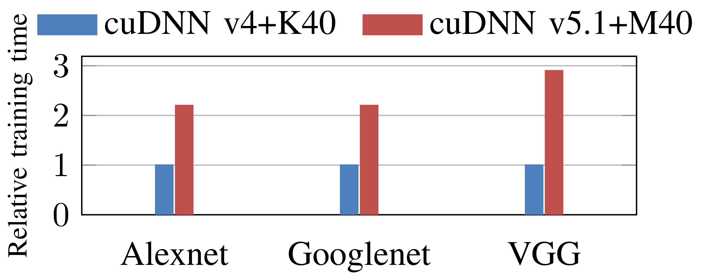

*图1：对不同网络架构的加速进行对比。在3x3的卷积核使用cuDNN v5.x后，图中的训练速度提升了2.7x。*

|            | k80+cuDNN 6 | P100+cuDNN 6 | V100+cuDNN 7 |
| :--------: | :---------: | :----------: | :----------: |
| 2.5x + CNN |     100     |     200      |     600      |
| 3x + LSTM  |     1x      |      2x      |      6x      |

*表格1：使用cuDNN v7.x能很大程度的改善性能*

工业生产时，充分利用算力来提升性能十分重要。不过，在使用5x5和7x7这样的大卷积核计算时，计算开销通常会非常的高昂。例如，在一个具有m个卷积核的网络上有n个5x5的卷积核，其计算成本就要比相同数目的3x3卷积核高2.78倍(25/9)。当然，5x5的卷积核可以在前期网络层中，获取激活单元之间的信息相关性，因此减小卷积核的尺寸可能会耗费更大的成本[8]。除了性能之外，较大卷积核上的每个参数，无法像3x3卷积核上的参数那么高效。我们也许可以这样理解，由于较大的卷积核对输入数据较大的领域空间进行捕获，因此可以在一定程度上对噪声进行抑制，从而能够更好的捕获输入数据的特征。在实际中，大卷积核所占用的计算资源，使其无法成为一个理想的选择。而且，较大的卷积核可以分解为多个小卷积核[8]，因此使用大卷积核使得每个参数的效率下降，从而造成不必要的计算负担。使用小卷积核代替大卷积核，在曾在[7, 8]中进行过研究和探讨。另一方面，小卷积核(包括3x3的卷积核在内)都不会去捕获数据的局部相关性。一组级联的3x3卷积核可以代替任意一个比较大的卷积核，且能达到相同的感受野。此外，入之前所说，这样做也能带来性能上的提升。

#### F. 均衡方案

通常，我们会建议在网络中等比例的分配神经元个数，因为不均匀的分配会导致某些层中的信息短缺，从而造成操作无效。例如，如果前期层没有足够的神经元来容纳低级特征，或者隐藏层没有足够的空间容纳中级特征，那么输出层则没有足够的信息进行抽象。这适用于网络的语义层，也就是当输出层没有足够的容量，那么网络将不能为精准判断提供更高级别的语义抽象。因此，为了增加网络的容量(也就是神经元的数量)，最好就是将神经元散布在整个网络中，而不是仅仅添加在一个或几个特定的层中[8]。在深度学习架构中神经元分布不均，就是导致网络结构退化的原因之一。随着网络结构的加深，网络中适当的分配处理能力变得越来越差，这个原因也会导致一些较深层的网络架构表现不佳。这实际上就是处理级饱和和枯竭问题的原因。我们将在实验结果章节对此进行详细的描述。使用均匀分配的方案，可以让网络中的所有语义层的容量增加，并为性能做出贡献；反之，若仅为某些特定的层增加容量，增加的这些容量可能会被浪费。

####  G. 快速成型技术

对网络架构进行调整前，使用不同的学习策略对网络架构进行测试是非常有必要的。大多数时候，需要改变的并不是网络架构，而是优化策略。选择了不适合的优化策略会导致网络结构的效率低下，从而浪费网络资源。一些很简单的超参，比如学习速率和正则化方法，如果没有进行正确的调整，通常会对网络结构产生不利的影响。因此，建议首先使用自动优化策略对网络结构进行快速的测试，当网络架构完成时，仔细调整优化策略可以使网络的性能最大化。我们在对其中的某个新特性进行测试或修改时，需要保证其他的设置是不变的。例如，当测试5x5和3x3的卷积时，需要保证网络整体的熵保持不变。在很多实验中，这条规则经常被忽略，从而导致测试结果的不准确，或是得到更加糟糕的推断结果。

#### H. 利用Dropout

深层网络架构中，Dropout几乎是必备的一部分，其也通常被认为能起到很好的正则化作用。Dropout可以理解为几个网络的集合，其会在几个不同的子训练数据上进行训练。Dropout所具有的正则化能力，对于卷积层来说，就像是在输入数据中添加了噪声，增加了相关卷积核的健壮性。为了避免过拟合，我们通常会将一半的特征检测器关闭[40]。然而，这常会导致网络需要花费更多的时间才能收敛，甚至是不收敛，为了弥补这一点，需要向网络添加额外的参数，不过这样也会导致在计算和内存使用方面有着比较高的开销。为了能够很好的应用这项技术，[42]中不仅仅是全连接层，几乎所有的卷积层后面都跟有Dropout层，在那时这样的做法看来对避免过拟合起到了很好的作用。近期，[6]中将Dropout用于所有卷积层，并将失效率调的比较低。我们的实验和文献[61]都发现，在所有卷积层上应用Dropout的技术，可以在一定程度上提高网络的精度和泛化能力，这归因于神经元在不同网络层中的具体行为。当网络结构中大部分的神经元从未被激活，从而导致网络容量被大量浪费的情况，称为僵化的ReLU问题。这个问题可以使用几种方式避免(例如：使用非线性族的ReLU[11, 20])。另一种方法就是通过随机关闭一些神经元，使得学习到的特征更加稀疏，使得这些神经元的贡献值为负值，从而平衡神经元之间的权重值，从而避免问题的发生。Dropout能够随机的关闭一些神经元，因此能避免僵化ReLU问题(见图2和图3)

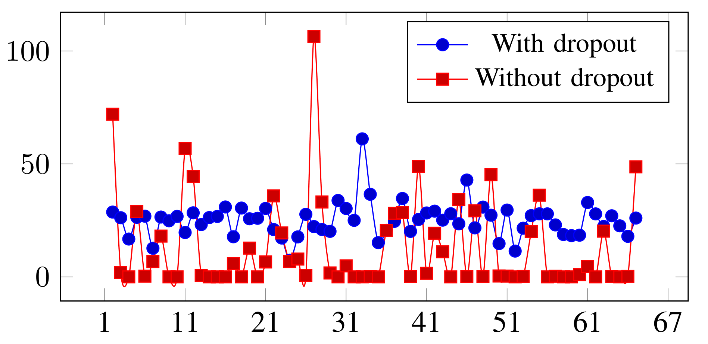

*图2：层1中神经元使用和没有使用dropout的区别。在使用dropout时，更多的神经元被激活，这也就意味着获得了更多比较好的滤波器。*

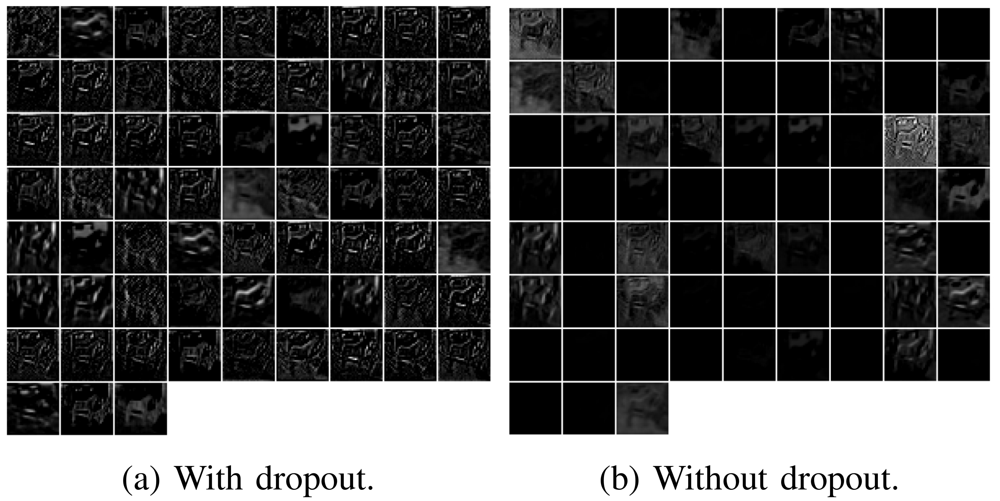

*图3：使用dropout之后，所有的神经元都被迫参与到学习过程中，因此会减少死亡神经元的产生。其结果就是产生的滤波器更加的多样化，更加的健壮。*

此外，深度网络架构是由不同类型的非线性函数组成，Dropout能让网络适应新的特征组合，从而提高其健壮性(详见图4)。

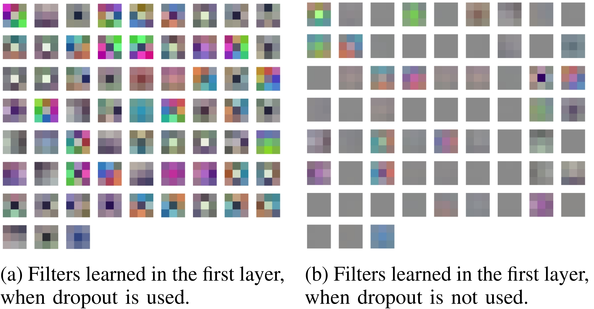

*图4：当不使用dropout时，滤波器样式比较单一，并且很多单元都是死的，这也表明学习数据中存在着很大的噪声。*

其还通过抑制复杂的协适应性，来改进分布式的效果[40]。这都可以在前期层中观察到，因为CNN网络架构中，前期层捕获都是一些公共特征，所以所有神经元具有比较平均的值(这是一个比较理想的结果)。Dropout通过更好的稀疏性，提高了网络的泛化能力。这可以通过较高层的神经元激活来查看，这表明有很多的神经元在0值左右被激活[61] (详见图5)。

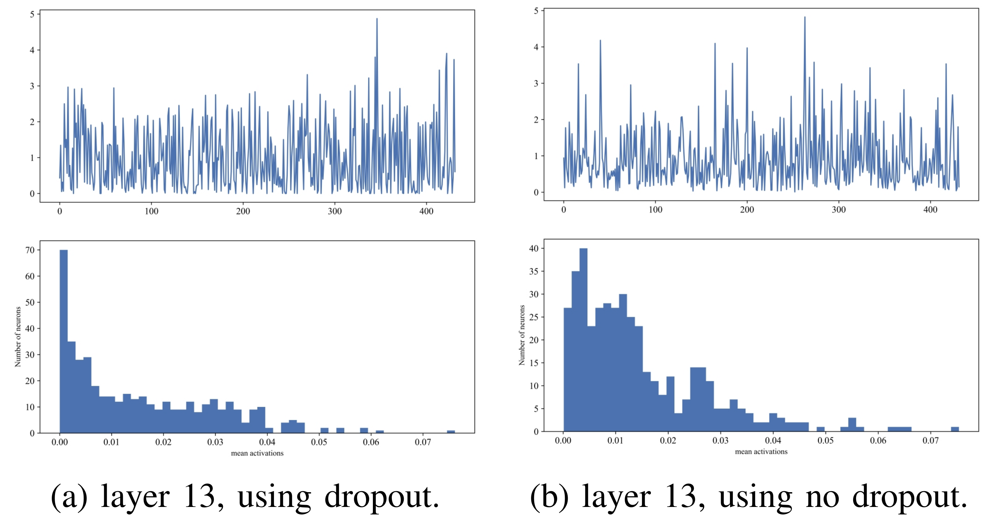

*图5：使用dropout时，更多的神经元在0左右被激活，这意味着有网络有更强的稀疏性。*

#### I. 简单的自适应特征组合池

最大和均值池化是在所有网络架构中使用最多的两种池化操作。当然，也有很多网络架构中使用着这些池化操作的变体[56]，并获得了不错的结果；我们这里也要提供一种池化变体——SAF-pooling，其与传统的最大或均值池化相比，可以为网络架构提供更优的性能。SAF-pooling其实就是在dropout前进行最大池化操作。如果我们将输入看作为一幅图像，池化操作就为其提供了一种空间转换的不变性，并且为接下来网络计算降低了计算复杂度。此外，由于遮挡、视点变化，光照变化等原因，同一类图像通常不能进行特征共享。因此，图像分类识别中起到重要作用的特征，可能不会出现在同一类的不同图像中。当在Dropout之前使用最大池化，其就能通过关闭一些已确定高激活神经元来模拟这样的情况(因为高激活神经元已经由最大池化合并)，其作用就是让这些特征好像是不存在一样。这种放弃高激活神经元模拟了由于一些客观原因所导致的输入变化，从而能学习到一些在较好学习样本中没有出现过的特征。因此，放弃高激活神经元能让其他神经元更好的参与到学习过程当中来。同时，网络也有很好的机会去适应新的和多样化的特征组合。此外，每个特征图中，都可能存在有不同的特征实例，并且我们可以进一步对这些实例进行研究，这不同于平均池化，所有特征图级的信息都会进行响应。通过这种方式，那些较弱的响应也有机会进行提升，从而形成更加健壮的特征检测器。这个概念会在论文补充部分进行可视化，并更加详细地进行描述。

#### J. 最终的方案

虽然我们尝试以规则或指南的形式制定更加准确的方法，但这些方法并非放之四海而皆准的。我们所总结提出的这些原则，旨在帮助大家实现在性能和效果上有比较良好平衡性的网络结构。因此，最好根据上述的设计原则来对网络结构进行构建，然后逐渐改善体系结构，以便找到性能与资源开销之间最佳的折衷方案。

### 4. SimpNet

根据我们上面提到的原则，我们构建了一个简单的13层卷积网络。该网络使用均匀的设计，使用3x3的卷积和2x2的池化。图6描述了其体系架构。

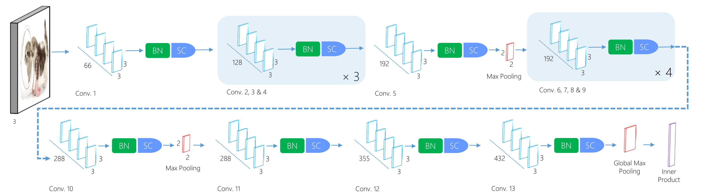

*图6：SimpNet未使用dropout的基础网络结构。*

为了基于上述原则设计网络，我们首先指定了可接受的最大深度，这样方便与其他更深和更宽的网络结构进行对比，从而来评估整个网络架构的设计。按照第一条原则，我们开始创建了一个具有10层的网络结构，然后逐渐将其宽度进行增加，从而对网络进行改善。然后，在宽度保持不变的情况下，再增加深度。反复实验过程中，宽度逐渐增加(与第一条原则和快速成型技术相关)。过程中，我们固定了所有层的宽度比，从而避免过多或过少的神经元分配(均衡方案)。为了使用原则，我们在具有相似特征的组中设计层，即相同数量的特征图和特征图尺寸(同类型的组)。为了尽可能地提取和保存更多的信息，我们减少了池化操作，因此每5个卷积层之后，放置1个池化层。这使得网络够具有良好非线性(从而对信息最大化利用)。通过几个测试，我们就能确定要将池化操作放在哪个位置。由于层组非常均匀，所以实验非常简单，就是在每组之后放置一个池化层。我们使用3x3卷积核最大程度地保留局部信息，并使用cuDNN库将性能最大化。为了评估不同网络的特性，我们又进行了一些实验，就是为了避免一些无关紧要的细节信息对最后结果的影响。所以，我们独立地进行实验，也就是当实验在运行时，所有准则都是确定的，不能进行修改。最后，修改网络以解决内部限制，即内存占用和参数数量(最终阶段的调节方案)。

### 5. 实验结果

这节中，我们设置了几个实验来说明以上原理的意义所在。最后的结果并没有对超参进行过任何的调整。这些实验使用的是我们框架的变体进行。架构总体与第4节中的介绍相同，两个原因让网络结构有了些变化，其一是为了不同测试用例之间的公平测试，其二为了让网络架构本身具有多样性。比如，我们尝试了具有不同深度和不同参数数量的网络架构。因此，每个实验中使用该网络架构的不同版本，就是为了强调其所使用的原理。此外，实验中的不同情况下，所使用的网络结构和优化策略时相同的，以便得到只对原则进行修改后的结果。我们在对每个网络结构进行评估时，都会对层数和参数数量进行记录，以便观察对于同一网络，随着参数数量和深度变化所得到的效果。我们将在以下的小节中，展示我们的实验结果，我们设计了两个不同类型的实验：首先对第3节给出的原则进行评估， 然后基于这些原则对网络结构(比如：SimpNet)的性能进行评估，并与几个领先的网络结构进行比较。

#### A. 实验细节

关于设计原理的实验使用CIFAR 10作为性能测试集。第二组实验会在4个主流的性能测试集上进行，CIFAR 10, CIFAR 100, SVHN和MNIST。CIFAR 10/100数据集[62]包含6万个彩色图像，5万个用于训练集，剩下的用于测试验证集。使用Top-1进行分类的性能评估。SVHN数据集[63]是源于谷歌街景的门牌号码图片。其由630420个32x32大小的彩色图像组成，其中73257个图片用于训练，26032个图片用于测试，另外531131个图片用于额外的训练。MNIST数据集[39]包括7万张28x28手写数字的灰度图，0到9，其中6万张用于训练，1万张用于测试。使用Caffe框架[64]对我们的框架进行训练，然后使用Intel Corei7 4790K CPU, 20GB内存和NVIDIA GTX1080 GPU的硬件组合来运行实验。

#### B. 设计审查

第一组实验所要检查的设计原则，会运行在CIFAR 10[62]数据集上。

**从最小分配逐渐扩展**

表2表明，逐步对网络进行扩展能得到较好的结果。将深度增加到某一界限可以提高精度(最多10层)，在此之后增加层数则会让准确率下降。

|  网络特性   | 参数数量 | 准确率(%) |
| :---------: | :------: | :-------: |
| Arch1, 8层  |   300K   |   90.21   |
| Arch1, 9层  |   300K   |   90.55   |
| Arch1, 10层 |   300K   |   90.61   |
| Arch1, 13层 |   300K   |  89.78   |

*表2：层数逐渐增加。*

这里值的注意的是，10层的网络要优于13层的网络。而在下一个实验中，较深的网络要比较浅的网络参数量更少。第3节的A和F小节中，对于影响深层次网络性能的原因之一就是处理能力分配不均，更具体的说就是处理级饱和和枯竭问题，可见表2和表3。

|  网络特性   | 参数数量 | 准确度(%) |
| :---------: | :------: | :-------: |
| Arch1, 6层  |   1.1M   |   92.18   |
| Arch1, 10层 |   570K   |   92.23   |

*表3：浅网络层vs.深网络层(与最小分配相关)，表明了即便具有很少的参数，也能使用逐渐增加的原则获得很好的结果。*

表中问题显示的很明确，特定网络结构中需要包括更多的处理或表达能力。可以认为在较浅的结构中，仍然可以容纳更多特征，直到其容量的饱和点；因此，在容量不饱和时，精度的差异可能会呈现一种不良的病态分布。处理级枯竭和饱和问题本身其实是处理单元分配的问题。此外，饱和是一个过程，从某一点开始，随着时间推移，饱和状态表现的越突出。我们指出这些，只是给读者留个印象，探寻结构饱和点已经超出了本文的范畴。SimpNet网络结构使用第2个原则的变体，具有不同的深度，我们在表格中使用**Arch1**来对其进行区别表示。补充材料中给出了更多有关架构，以及拓扑结构的信息。

除了第一个测试外，表3还展示了，一个较深具有相对较少的参数的网络，比更浅但更宽的网络得到更好的效果。更深的网络结构可以开发出更多有意思的功能，因此适当的进行扩充，可以让很多简单的功能组合起来，从而获得更好的推理结果。这也就是为什么在参数量不同的情况下，更深的网络执行的更好的原因。该实验表明了渐进分配方案中最小分配方法的重要性。表3中所使用的网络都是Arch1的变体。表4展示了关于在整个网络体系中如何进行均衡分配和分配不当所产生的结果。表4中我们使用的网络是[43]的变体，我们称其为**Arch2**。其中只使用前10层的结构我们标记其为10层结构，这里用于第二次测试的13层网络架构已经精简到128K个参数。

|        网络特性         | 参数数量 | 准确率(%) |
| :---------------------: | :------: | :-------: |
| Arch2, 10层(非平衡分配) |    8M    |   95.19   |
|  Arch2, 10层(平衡分配)  |    8M    |   95.51   |
| Arch2, 13层(非平衡分配) |   128K   |   87.20   |
|  Arch2, 13层(平衡分配)  |   128K   |   89.70   |

*表4：平衡分配方案使用10层和13层的SimpNet网络结构变体，来展示每一层的分配差异如何导致最后结果不同，以及通过平衡分配改善最后结果。*

**最大化信息利用率**

我们将结果汇总在表5中，其显式的推迟池化操作在网络结构中的效果，并且展示了如何以较大的特征图来利用更多的信息来提升网络的精度。这个表中的网络也是SimpNet的一个变体，这个网络结构具有13层和53K个参数，其可以对池化进行推迟和不推迟的操作。我们称这个架构为**Arch3**。为了评估其效果，我们会每次在不同的层上应用池化操作，其他都保持不变。L5、L3和L7分别指层5, 层3和层7。这个结果就是为了展示改进后和刚开始的网络结构的效果。

|      网络特性      | 参数数量 | 准确度(%) |
| :----------------: | :------: | :-------: |
| Arch3, L5 默认方式 |   53K    |   79.09   |
| Arch3, L3 提前池化 |   53K    |   77.34   |
| Arch3, L7 推迟池化 |   53K    |   79.44   |

*表5：在不同层上使用池化的效果。前期网络层中过早的使用池化对于准确度来说是不利的。*

**跨距卷积 vs. 最大池化**

表6展示了，无论体系结构、数据集和参数有多少，池化操作都会优于跨度卷积。

| 网络特性 | 深度 | 参数数量 | 准确率(%) |
| :------: | :--: | :------: | :-------: |
| SimpNet∗ |  13  |   360K   |   62.28   |
| SimpNet∗ |  15  |   360K   |   68.89   |
| SimpNet† |  15  |   360K   |   68.10   |
| ResNet∗  |  32  |   460K   |   93.75   |
| ResNet†  |  32  |   460K   |   93.46   |

*表6：†表示使用的跨距卷积 vs. \*表示最大池化。最大池化的效果在相应的网络结构中，要好于跨距卷积。前三行的数据使用CIFAR 100作为测试集，最后两行是以CIFAR 10作为测试集。*

和我们开始所想的一样，实验结果对两种理论进行反驳：1.下采样可以用跨距卷积替换池化；2.跨距卷积要优于池化。除了这些，从设计的角度来看，跨距卷积会为网络结构带来更多不必要的开销，从而与设计初衷不符，特别是逐渐扩展和最低分配这项。更加确切地说，其引入了点对点的分配策略，从而会将处理级枯竭问题引入到架构中。为什么这么说，会在补充材料中进行解释。

**保留关联性**

表7展示了关联性的作用，以及为什么在网络结构中3x3即有较少的参数，比那些更大的卷积核好。表8描绘了几个具有相同内容，但类型的不同的几个网络结构，并展示了在不同的位置的层上，1x1/2x2/3x3的卷积核是如何进行比较的。

|  网络特性  | 参数数量 | 准确率(%) |
| :--------: | :------: | :-------: |
| Arch4, 3x3 |   300K   |   90.21   |
| Arch4, 3x3 |   1.6M   |   92.14   |
| Arch4, 5x5 |   1.6M   |   90.99   |
| Arch4, 7x7 | 300K.v1  |   86.09   |
| Arch4, 7x7 | 300K.v2  |   88.57   |
| Arch4, 7x7 |   1.6M   |   89.22   |

*表7：卷积核大小和网络参数数量的不同组合，导致输出精度的差异，这表明了关联性会直接影响网络结构整体的精度。*

|                     网络特性                     | 参数数量 |    准确率(%)    |
| :----------------------------------------------: | :------: | :-------------: |
|         Arch5, 13层，1x1 vs. 2x2(前期层)         |   128K   | 87.71 vs. 88.50 |
|         Arch5, 13层，1x1 vs. 2x2(中间层)         |   128K   | 88.16 vs. 88.51 |
| Arch5, 13层，1x1 vs. 3x3(较小和较大输出层的比较) |   128K   | 89.45 vs. 89.60 |
|    Arch5, 13层，2x2 vs. 3x3(更大尺寸的特征图)    |   128K   | 89.30 vs. 89.44 |

*表8：网络的不同部分使用不同的卷积核大小，对网络整体的性能是有影响的，也就是最能保持特征关联性的内核会产生最佳的精度。同样，前期层的特征关联性要比后期层更为重要。*

可以从表中看出，前期层中使用1x1对于网络结果的影响比较大，而在中期层中应用1x1对网络最后的结果影响并不大。在所有情况下，2x2卷积要优于所有1x1卷积的结果，而3x3卷积要优于前两者。

这里，我们使用了几个不同大小的内核进行测试，其中有两个不同的变体，一个有300K个参数，另一个具有1.6M个参数。在使用7x7的网络会有更多的参数，因此在和使用3x3卷积相同的网络结构下，7x7的网络参数就有1.6M。此外，为了减少参数的数量，层中需要较少的神经元(减少通道数量)。因此，我们为基于7x7的模型创建了两个具有300K个参数结构的网络变体，这样既能证明7x7卷积核的作用，又能尽可能地保持整个网络的计算能力(即3x3 vs. 7x7)。另一方面，我们也将基准框架的参数格式从300K增加到1.6M，从而对3x3的卷积核进行测试。表7展示了这些架构的结果，其中300K.v1的网络架构与原来的架构相同，不过是将神经元的个数减少到了300K个而已。300K.v2也与原来的网络架构相同，不过7x7卷积核尽在前两层使用，其余层都是用3x3的卷积核。这样就能证明使用了7x7卷积核的效果，而网络中的大多数层都和3x3卷积核构成网络中的对应层容量相同。最后，使用7x7卷积核具有1.6M个参数的网络结构，与使用3x3卷积核具有300K个参数的网络结构的结果几乎持平。为了公正性，我们还将使用3x3卷积核的网络架构中的参数个数增加到1.6M，并测试这些框架在不同场景下的运行效果。我们还是用了5x5的卷积核和1.6M个参数的网络进行测试，并给出几乎与7x7卷积核和1.6M个参数的网络结构相同的结果。这次用于测试的SimpNet结构具有8层，我们称其为**Arch4**。表8中，使用的也是SimpNet的变体，其深度或参数数量有些变化，我们用**Arch5**来表示。

**隔离实验**

图9展示了在尝试不同网络超参时的一个无效的假设。

|          网络特性          | 准确率(%) |
| :------------------------: | :-------: |
|       使用3x3卷积核        |   90.21   |
| 使用5x5卷积核代替3x3卷积核 |   90.99   |

*表9：用同一种网络结构对3x3和5x5的卷积核分别进行测试。*

接下来，我们将对5x5卷积核进行测试，看下其是否能比3x3的卷积核有着更好的精度。结果表明，5x5的卷积核的精度更高。然而，这个高精度是由于第二种网络架构中有着更多的参数，从而使得网络的精度更高。两个网络架构相同，不过第一个有300K个参数，第二个有1.6M个参数。第二个例子可见表10，其参数数量和网络容量都被忽略。

|        网络特性         | 准确率(%) |
| :---------------------: | :-------: |
| 开始阶段使用5x5的卷积核 |   89.53   |
| 末尾阶段使用5x5的卷积核 |   90.15   |

*表10：这是一个错误的示范，在不同等的条件下进行实验比较。*

通过实例测试，将5x5的卷积核放在开始要比放在末尾要好。实验证明，第二个网络架构应该是首选，不过可以清楚的看到，第一个网络架构只有412K个参数，而第二个网络架构有640K个参数。因为两个网络架构的容量是有差别的，所以这里的假设无效。

**SAF-pooling**

为了对我们在第3小节的I子节中提到的有效性进行评估，我们在CIFAR 10数据上进行了一些测试，这些测试使用了不同的网络框架，有使用和没有使用SAF-pooling操作的框架。我们使用SqueezeNet v1.1和我们的精简版框架进行对比。结果如表11所示。

|    网络特性     | 准确率(%) 有-没有 SAF-pooling操作 |
| :-------------: | :-------------------------------: |
| SqueezeNet v1.1 |       88.05(avg)–87.74(avg)       |
|     SimpNet     |            94.76–94.68            |

*表10：使用SAF-pooling操作提升网络架构性能。在CIFAR 10测试集上进行测试。*

#### C. SimpNet在不同数据集上的结果

CIFAR 10/100[62]、SVHN[63]和MNIST[39]数据集上对SimpNet进行测试，以评估我们设计的网络架构，并将我们设计的网络架构，与目前顶级的网络和更深的网络架构进行了对比。我们使用以0进行填充的方式，并在CIFAR 10/100数据集上进行镜像填充。 MNIST[39], SVHN[63]和ImageNet[5]数据集上的测试，并没有在数据增强的情况下进行。实验中，我们对所有数据集进行了统一的配置，并没有进行微调，除了CIFAR 10之外。我们这样做的目的就是，看有没有一种配置可以泛化到所有的场景中。

##### 1) CIFAR10/100

表12展示了不同架构所得到的结果。

|         网络结构          | \#参数数量 |   CIFAR 10    |  CIFAR 100  |
| :-----------------------: | :--------: | :-----------: | :---------: |
|  VGGNet(16L) [65]/增强版  |    138m    | 91.4 / 92.45  |      -      |
| ResNet-110L / 1202L [2] * | 1.7/10.2m  | 93.57 / 92.07 | 74.84/72.18 |
|   SD-110L / 1202L [66]    | 1.7/10.2m  | 94.77 / 95.09 |  75.42 / -  |
|  WRN-(16/8)/(28/10) [9]   |   11/36m   | 95.19 / 95.83 | 77.11/79.5  |
|       DenseNet [6]        |   27.2m    |     96.26     |    80.75    |
|   Highway Network [37]    |    N/A     |     92.40     |    67.76    |
|        FitNet [52]        |     1M     |     91.61     |    64.96    |
|    FMP* (1 tests) [14]    |    12M     |     95.50     |    73.61    |
|     Max-out(k=2) [15]     |     6M     |     90.62     |    65.46    |
|  Network in Network [41]  |     1M     |     91.19     |    64.32    |
|         DSN [67]          |     1M     |     92.03     |    65.43    |
|     Max-out NIN [68]      |     -      |     93.25     |    71.14    |
|         LSUV [69]         |    N/A     |     94.16     |     N/A     |
|          SimpNet          |   5.48M    |  95.49/95.56  |    78.08    |
|          SimpNet          |    8.9M    |     95.89     |    79.17    |

*表12：CIFAR10-100的结果。*

我们尝试了两种不同的CIFAR 10实验，一种没有数据扩充，即没有零填充和归一化，另一种使用了数据扩充。前一种方式达到了95.26%的准确度，后者达到了95.56%的准确度。简单向网络架构中添加更多的参数，不需要对体系架构进一步的进行微调或大量的修改，我们就可以轻松地超越所有WRN(宽残差网络)的结果，参数范围从8.9M(在相同的模型复杂度下)到11M、17M，以及在CIFAR10/100的测试中达到36M。其中具有36M个参数模型的结果与目前CIFAR 100最好的记录已经十分接近了。这说明，该架构的参数和层虽然少，但是仍然5M个参数限制的情况下，达到我们意料之外的结果。因此，若通过增加参数的数量，这个网络甚至能超过一些更为复杂网络的准确度。

##### 2) MNIST

这个数据集上，我们有没有使用数据增强和微调，但我们也获得目前第二高的分数。[18]中集成了目前最先进的数据增强模型。我们也简化了我们的架构，只有300K个参数，并达到了99.73%的准确度。详见表13。

|             网络架构              | 误差率 |
| :-------------------------------: | :----: |
| Batch-normalized Max-out NIN [68] | 0.24%  |
|    Max-out network (k=2) [15]     | 0.45%  |
|      Network In Network [41]      | 0.45%  |
|  Deeply Supervised Network [67]   | 0.39%  |
|           RCNN-96 [70]            | 0.31%  |
|              SimpNet              | 0.25%  |

*表13：在没有数据增强情况下，MNIST测试集上的结果。*

##### 3) SVHN

和 [15, 41, 66]一样，我们仅适用训练和测试集进行实验，并没有使用任何数据增强技术。可以在表14中看到最好的结果。我们瘦身完后的网络架构，只有300K个参数，就能达到1.95%的误差率。

|              网络架构               |  误差率   |
| :---------------------------------: | :-------: |
|       Network in Network[41]        |   2.35    |
|      Deeply Supervised Net[67]      |   1.92    |
| ResNet[2] (reported by [66] (2016)) |   2.01    |
|  ResNet with Stochastic Depth[66]   |   1.75    |
|             DenseNet[6]             | 1.79-1.59 |
|           Wide ResNet[9]            | 2.08-1.64 |
|               SimpNet               |   1.648   |

*表14：SVHN测试数据集上的测试结果。*

##### 4) 较少参数的网络架构

当处理能力降低时，有些架构不能很好地进行扩展。这就表明网络设计不够健壮，并不能充分利用其处理能力。我们尝试了一个精简的版本，其参数只有300K，这样就能来查看其执行效果是否依然有效。表14展示了我们只具有300K和600K个参数的模型，与其他具有2x到20x参数的网络结果相当。可以看出，精简后的架构要比ResNet和WRN网络具有更少的参数，并且在测试集上的结果也差不太多。

|                模型                |    参数     |   CIFAR 10    |   CIFAR 100   |
| :--------------------------------: | :---------: | :-----------: | :-----------: |
|                Ours                | 300K - 600K | 93.25 - 94.03 | 68.47 - 71.74 |
|            Maxout [15]             |     6M      |     90.62     |     65.46     |
|              DSN [67]              |     1M      |     92.03     |     65.43     |
|            ALLCNN [42]             |    1.3M     |     92.75     |     66.29     |
|            dasNet [71]             |     6M      |     90.78     |     66.22     |
| ResNet [2] (Depth32, tested by us) |    475K     |     93.22     |  67.37-68.95  |
|              WRN [9]               |    600K     |     93.15     |     69.11     |
|              NIN [41]              |     1M      |     91.19     |       -       |

*表14：精简版本的网络架构在CIFAR 10/100数据集上进行测试的结果。*

### 6. 总结

本文，我们提出了一系列构建网络架构的原则，一个新的池化层，详细观察了设计中的不同的部分，并最终完成了一个轻量级网络架构——SimpNet。尽管SimpNet的参数和操作数量要少很多，但其性能要优于更深和更复杂的网络架构。不过，其目标不是设定最先进的技术程度，而是展示所提出原则的有效性。我们认为一个好的设计就应该能有效的利用处理能力，并且我们精简版本的网络架构中具有更少数量的参数，其性能也优于更深和更复杂的网络架构。我们有意的将自己设计的网络体系局限于一些层，这样其基本因素就能让我们忽略那些不必要的细节，并能让我们集中精力于网络架构关键的方面，通过保持运算能力，从而提高运行效率，进而能对影响性能设计的子模块做更为深入的研究。未来，迫切的需要为深层网络架构的设计进行研究，以便能为更加高效的设计更好的网络提供指导性意见。

### 鸣谢

这里要感谢Sensifai的CTO，Ali Diba博士，给予我们帮助与指导。马里兰-巴尔的摩大学助理教授，Hamed Pirsiavash博士，给了我们的工作很多富有见地的评论

*引用文献部分请读者在原文章中进行查找。*

# 补充部分

## S1.  深入讨论

### A. 跨距卷积 vs. 最大池化

表6中展示了池化操作是如何优于跨距卷积的(不论是网络结构、数据集，还是参数数量)。我们所要反驳的假设是：1）下采样时，跨距卷积可以代替池化。2）跨距卷积的效果要优于池化。此外，从设计角度来看，跨距卷积给网络架构带来了不必要的开销，因此与渐进扩展和最小分配原则矛盾。其引入了点对点分配，从而导致了处理级枯竭问题。假定处理能力Y对应的最佳网络深度是X，使用渐进扩展的方式，使用池化操作将深度扩展到X，现在使用跨距卷积替换池化层，将K层卷积引入架构(K也是池化的层数)。在有限的计算资源面前，网络很可能会面临处理级枯寂的问题，因为这时神经元在该深度上并不是最优的均衡分布。此外，为了对处理级枯竭问题进行处理，需要大幅度的增加容量以适应K个新层。因此，最终得到的网络结构与使用池化操作的结构相比，性能会差很多。因为卷积不等于池化，其只能对池化层的下采样部分进行模拟。从得到的结果中，可以清楚的看到这一点。在参数相同的情况下，13层带有池化的网络架构，结果要优于15层具有跨距卷积的网络架构。对于第一个论点，即便是15层带池化的版本，也要好过跨距卷积的网络，尽管二者都会出现处理级枯竭的情况，但是基于池化的网络架构效果要好的多。对于第二个论点，我们使用具有32层的ResNet进行测试。ResNet在使用池化层的时候，效果会表现的更好。相同深度、参数数量和分布的情况下，基于池化层的网络架构要优于跨步卷积的网络架构。因此，不建议使用跨步卷积来代替池化。

### B. 简单的自适应特征池化

最大和平均池化是常用的池化操作，所有网络架构都会用到。池化操作也有很多的变体[1]，也能得到令人满意的结果，我们在这里提出了一种变体称为SAF-Pooling，与传统的池化操作相比，其效果更佳好。SAF-Pooling就是在完成Dropout操作前，进行最大池化操作。

### C. SAF-Pooling直观感受

如果将输出视为图像，则池化操作通过空间变换不变性，减少了网络层上计算的复杂度。然而，池化层是将一系列不同的特征汇集到一起，这实际上可能是多个层上的特征缩小之后的结果，其将选择较为突出的特征用来对输入进行描述。这样，就能将与任务相关的信息进行保留，从而抛弃无关的细节信息。需要注意，若将输入视为图像，那么由于非重叠的池化与对应的池化操作部分的输入来说，会损失更多的空间信息，因此这里需要重叠在一起的池化操作。如果前提假设不成立的话，那么非重叠池化将会是更好的选择。可以注意到，在我们的实验中，非重叠版本的性能要比重叠版本高出许多，这个提升可以总结成两个原因：1）由于网络的分布和层次性表示，前期底级层获取到的多为细节特征，后期高级层获取到更多的抽象特征。2）更深的网络架构，由于输入图像本质的改变，所以不再等同与输入图像与表示，而是所谓的特征图，每个像素都可能会为特征图有所贡献。某些阶段之后，图像的概念将失去意义，因为输入的空间维度可能缩小到肉眼无法识别的程度(想象32x32的CIFAR 10数据集中的图像，缩小到8x8的网格中)。考虑到这两点，我们似乎意识到，真正需要处理的是网络中的特征图，尤其是在网络架构的中高层。因此，第二点似乎更有意义，至少在后期层中池化能将相应的特征进行会集；而在前期层中，需要用到图像的更多的属性。第一点可能更适用于语义分割和物体检测，而除此之外的应用则可能不适用。此外，非重叠池化操作导致信息加速丢失，通常是由于池化操作适用的过于频繁所引起的，我们会在非常深的结构中看到这样的情况。那为什么会有人这样做呢？因为池化操作能减少计算量，从而能让网络运行的更快。因此，在没有这种先决条件的情况下，不重叠的池化不会造成问题，而且还会带来效果收益，正如我们实验中展示的那样。因此，我们遵循第二个原则。另一个是平均池化，它和最大池化处理的方式相同吗？平均池化是让激活值做出平等的贡献。这样做可能会降低激活值，因为平均包含有很多低的激活值。然而，最大池化能得到最强的激活值，并且忽略池化操作中其他的所有激活值[2]。我们看到，在早期层使用平均池化层对于精确度有着不利的影响。不过，在网络的较高层中，这两种方式的差异并不大。此外，由于遮挡、视点变化、光照前度的变化等因素，同一类别的图现象往往不具有相同的特征。因此，一些重要的特征可能不会出现在同一类中的不同图像上。当将最大池化放在Dropout操作之前，其通过删除高激活来模拟这种情况(因为高激活已经被最大池化所合并)，就像是这些特征从来没有存在过一样。在Dropout后放置池化，可以模拟随机池化的操作，该操作随机的对神经元进行关闭。在我们的实验中，这种组合的效果不是很好。这种放弃最大激活的过程就是在模拟由于遮挡等一些原因，使得一些重要特征产生变化的情况。因此，关闭高激活，能让其他不突出的特征称为重要特征，这样也能让更多的神经元参与到网络的辨别过程中，也为网络提供网络更丰富和更多样化的功能。此外，每个特征图中，可能存在一些不同的特征，通过这些不同的特征，我们可以进一步的对这些特征进行研究。不同于平均池化进行性的特征图级的平均，这种方式让那些比较弱的响应都得到改进的机会，这样就会让相应的特征图在成为更健壮的特征检测器方面扮演更加重要的角色。同时，如果这些响应是假阳性的，那么则会在反向传播过程中对相应的操作进行抑制，从而让特征检测器更加健壮。这样，就能产生更加强壮的特征检测器，并且网络还能更好地学习特性类的特征[3]和相应的特征组合。接下来，我们将给出如何提高网络泛化的例子。

### D. SAF Pooling vs. 相关方法

SAF-Pooling操作和[3]中的工作十分类似，不过两种操作的执行方式还是存在着差异的。[3]中，第一步是将最高激活值设置为0。这个操作关闭了特征图中响应最为强烈的特征。我们的例子中，首先激活高激活值，然后在随机关闭其中一些。除此之外，我们使用Dropout的方式替代了[3]中概率选择的方式。这就能确保，在保证有足够的特征的同时，不会拖缓网络收敛速度。同时，通过关闭其他一些高激活的值，就逼迫网络去学习更加健壮的特征来弥补这些特征的确实，这样就能避免引入新的概率方案，从而使得程序更加复杂。此外，[2]中也提出了一个类似的层，称为最大池化Dropout层，其工作方式与[3]给出的方案相同，不同之处在于他们选择的是不同的概率方案。Wu等人[2]在最大池化前使用Dropout，因此需要执行某种类型的随机池化。与之相反，SAF-Pooling是由我们有意设计成这样的，从而能让所有事情变得简单。图S1展示了我们的想法。

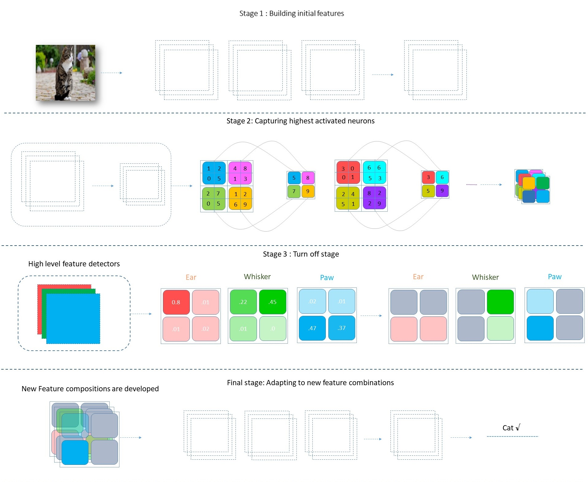

*图S1： SAF-Pooling：该方案中，网络被迫去通过激活一些特征值，来适应不同的特征组合，从而在由于遮挡、视点变化、噪声等因素印象下，仍然能有可以使用的特征来对输入进行辨别。这个过程分为几个阶段进行：在一些中/高级特征可用的情况下(阶段1)，将最显著的响应特征进行汇聚(阶段2)。然后，其中一些特征会被选择性的关闭。网络必须适应一些重要特征的确实，从而开发新的特征成分(阶段3)。在经过几次迭代后，由于较弱的特征有了更多可开发的激活，一些较为不相关的特征逐渐被信息量更大的特征所取代。随着周期性的训练，可以开发出更多的特征组合。因为更多的神经元进入了稀疏化的独立学习模式，所以使得网络容量利用率最大化，最终通过对特征的组合，开发出更加多样化的特征检测器。*

### E. 可视化SAF-Pooling

为了能更好的说明在这种思想下，是如何影响网络性能的，我们进行了一系列的实验。在下面的一组图中，我们将通过可视化的方式展示网络的变化，特别是在网络的高层，以这种方式能够更好的观察，SAF-Pooling层是如何对网络的性能进行改善的。这种观察方式，不适合于用在前期的池化层上，这也意味着使用重叠的池化来保持图像的空间信息没有太大的意义，如果只将其当做简单的特征图来看待，其让网络提高的方式简单的出奇(即SAF)。图S2展示了一个头/颈部检测器。

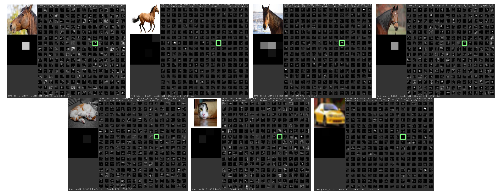

*图2：整个网络中，输入转变成特征图，其中每个相应都表示有相应的特征存在。使用最大池化操作，就可以将最突出的相应进行捕获，并在之后的通道中形成更加有趣的特征组合。*

接下来通过最大池化操作，捕获最突出的响应。可以将此机制视为一种对有效特征的过滤方法，并在最后得到健壮的特征组合。这里使用到的可视化工具是DeepVis工具箱[4]。

这种观察方式对于网络性能和其构造方式有着很重要的影响。这样，我们就能了解网络架构中在处理些什么东西，这将有助于我们设计出更加直观，以及性能良好的网络架构。当我们在处理特征时，这似乎是符合逻辑的，并且我们可以简单对显著的特征进行过滤，从而通过动态显示的方式创造出一些新的特征组合来增强特征的分布。这可以使得网络有更好的灵活性，并且会引起很多的变化(当有些特征消失时，其他特征还存在)。这样的方式，直接让自适应特征组合池化操作变得简单了。图S3中，我们可以看到网络如何在CIFAR 10数据集上进行训练，其能识别很多难以识别的样本。这个网络就使用了简化的自适应特征组合池化操作。

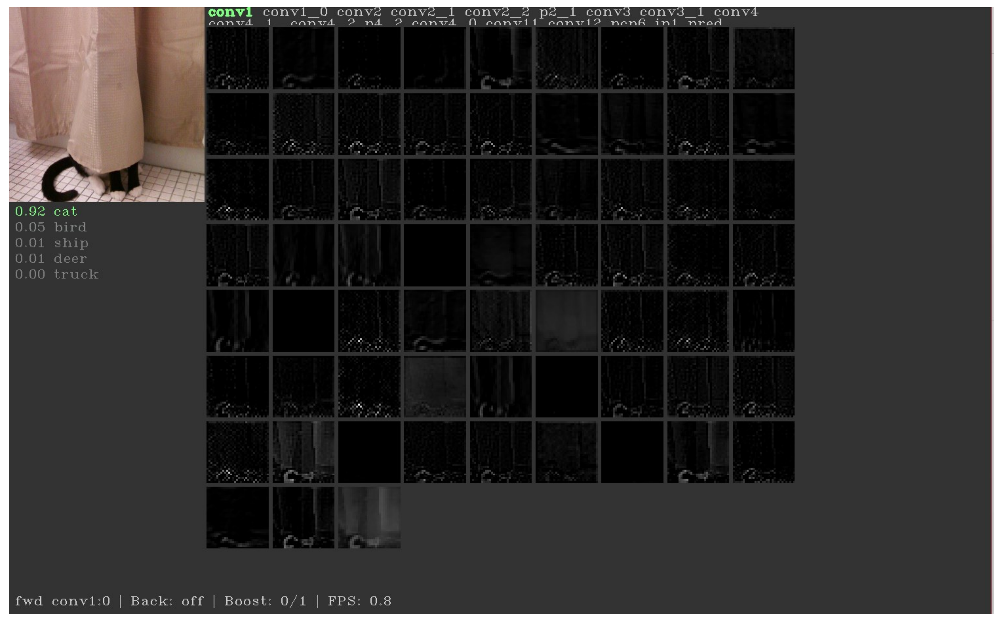

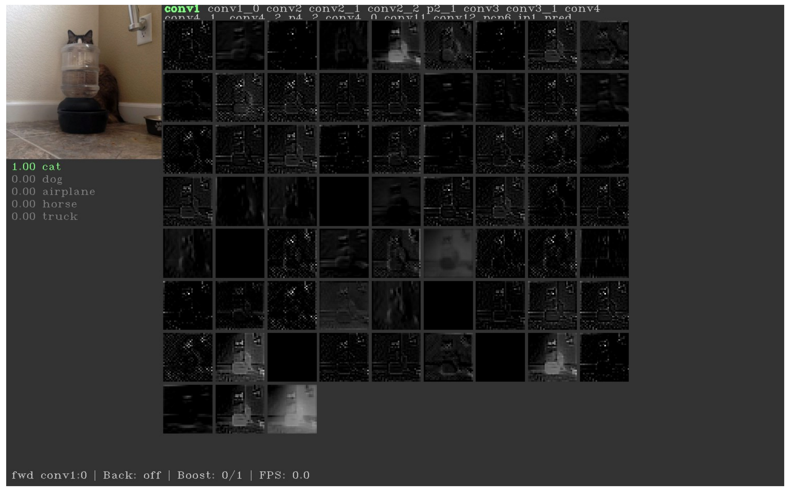

*图3：在缺少某些特征的情况下，网络已经学会使用其他特征，并且成功的将喵识别了出来。*

接下来的例子还展示了，网络如何通过健壮的特征来对特定类的图片进行识别。我们创建了一个随机的图像，其类似于CIFAR 10中存在的几类图片，我们就是要看看网络是否能将这几个类识别出来(即预测的5个结果，其中一个需要与正确的类型相关)。图S4展示了这个样图。

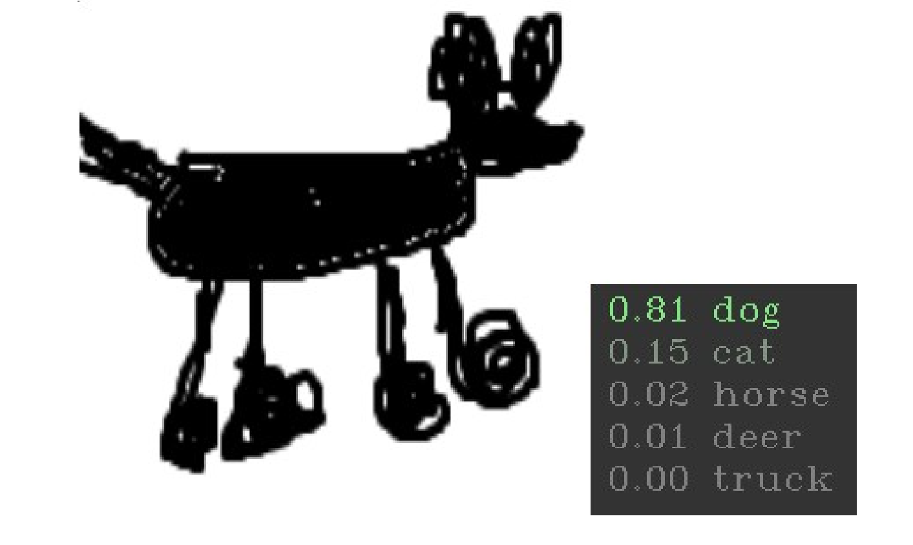

*图S4：使用合成图像来测试网络的泛化能力和特征的鲁棒性。*

有趣的是，网络成功的识别了这张图片。有些特征会对应多个类，而网络则要使用这些特征来对输入进行标识。从而，网络不仅要学习健壮的特征集，并且需要将这些特征集组合在一起使用。这将有助于网络架构更好的泛化，从而进行可能的避免对单一特征的依赖。

需要注意的是，图S4既不是狗，也不是猫或鹿，甚至不是任何一种生物/物体。它是以一些能够表现出来的特征进行创建的，因此与很多类型类似。用这个图进行测试的原因，是要看网络是否能做出合理的推测结果。比如，应该预测出是相似的类，而非任意的类。如果其预测结果是随机的，那么就意味着这个网络结构还没有学会如何使用学到的特征。需要注意的是，我们这里所说的预测结果，是指前5个预测结果(top5)。通过合理的预测，我们可以基于图像中的内容预测其归属的类别。不同类之间的相似性，是基于这些对象的抽象属性的。狗和猫不一样，马和鹿也不一样，但当我们人看到狗的不清晰图片时，我们也会将其误认为是猫，不过我们不可能将其误认为青蛙或罐头！这种不同类别间的区分，其相应的特征组对网络的泛化能力起着至关重要的作用。通过观察相应显著的特征，我们可以对实际物体进行推断。举个例子，通过观察一幅曲棍球手的海报，我们可以立即确定这幅海报是对人的描述，不过这里很多与人相关的特征，或者说是外表特征在这里都不可用。我们通过观察非常简单的汽车图画，可以正确的对画中内容进行识别。现在，我们需要面对这样一种情况，比如一开始我们并没有真正看请物体(第一次相遇)，或者是开始的形状或特征与我们观察到的不同，这也就意味着，我们可以完全使用一些抽象的属性或者说是相似度，对我们观察到的物体进行辨别。通过这种相似度，我们可以说这张图片比较像猫，不太像狗，但绝对不是青蛙、鲨鱼或飞机。这些信息对于改进泛化能力来说十分关键，因为其需要知道哪些是高抽象的特征，然后在这些信息的基础上判断相似度。这样的信息提取技术也很重要，这种方式可以直接用来对其学生网络进行训练。这种信息越准确，网络对不可见的数据表现的越好，对知识转移越有用。这样的信息可以看作是隐藏信息，网络可以使用这些信息来完成相应的任务，这种使用通常无法像网络参数那样能直接进行观察。因此，这是对于网络的性能可以带来极大的提升，因为我们为网络隐式的提供了其所需要的信息。这也是个很好迹象，表明网络是如何在不可见的数据上学习和执行的。这是一种很有趣的观察，并且能说明网络已经学习到了非常好的特征组合可以对一个类进行判别。这里需要再次强调神经网络分布的特点，从而对合理的对特征图进行认知，并不只是当其为图像。有了这样的观察力，网络就可以有效的利用学习到的这些特征，做出自己的判断了。

下图中(图S5和图S6)还展示了如何开发出健壮的特征，以及在变化输入时，这些特征是如何健壮起来的。需要注意的，这次是在CIFAR 10数据集上进行训练，并没有任何的微调，也没有对数据进行扩充。这里只是使用了相同的网络结构，在CIFAR 10数据集上进行训练。

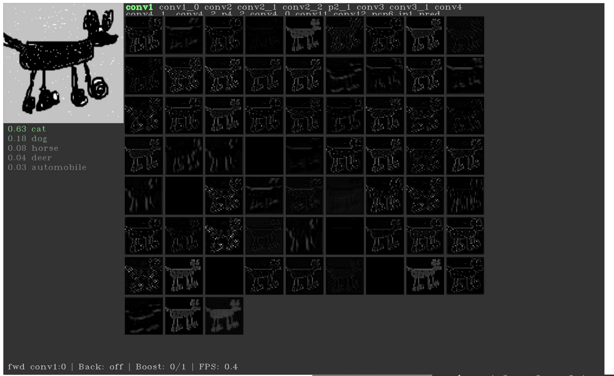

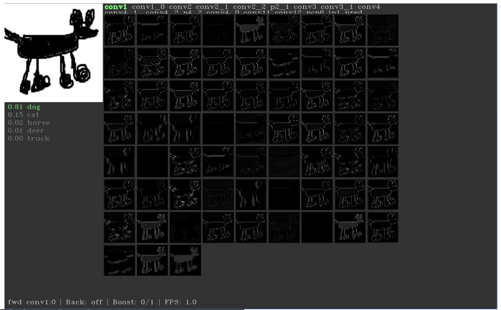

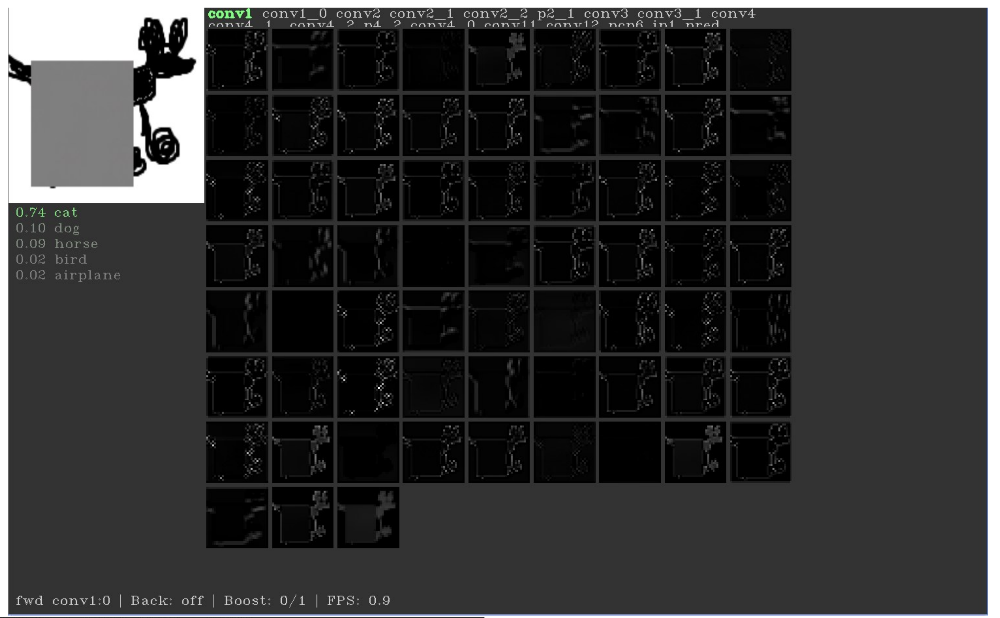

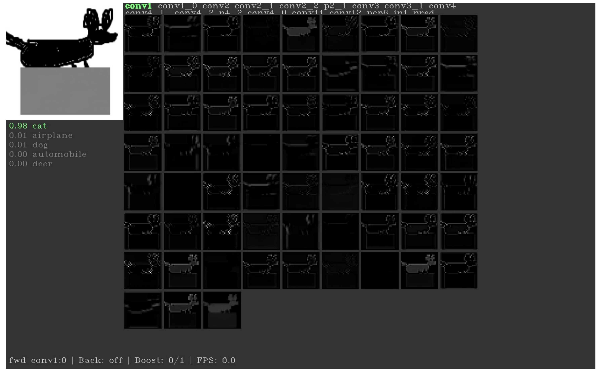

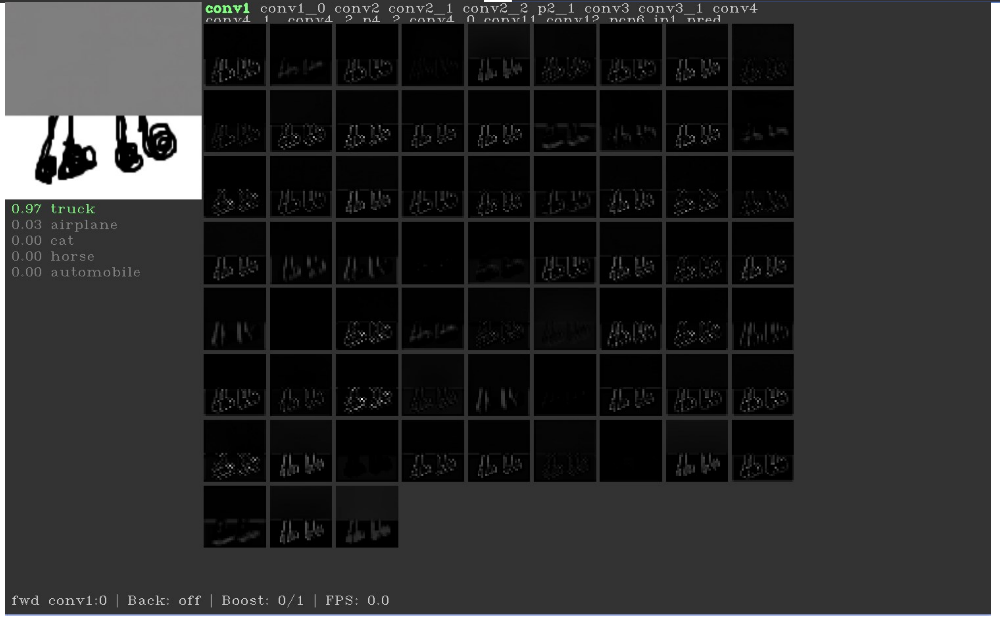

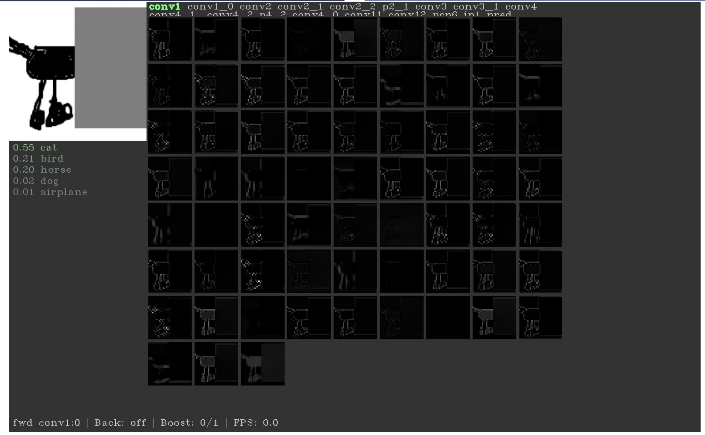

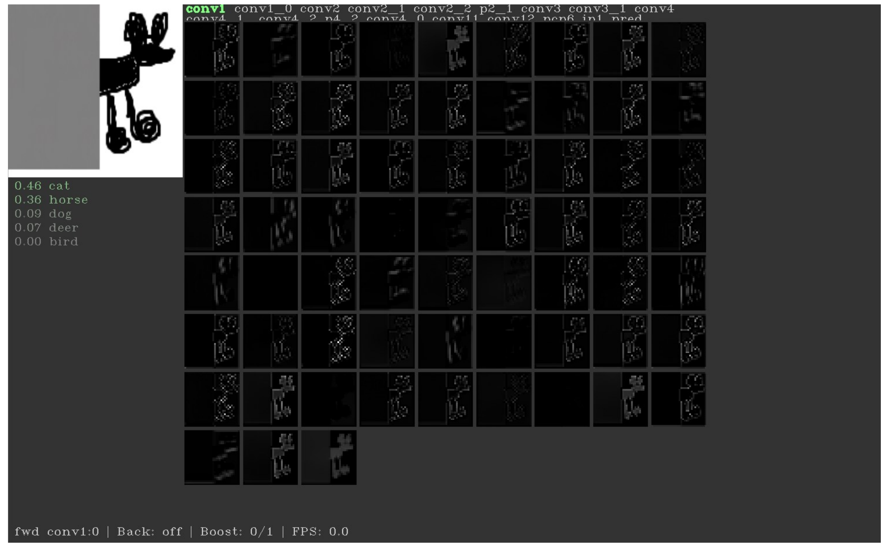

*图S5：我们创建一些图来查看网络的响应情况，看下网络是否是随机的，或者符合学习到的特征。这里可以看到网络成功的列举出相近的类别，这些类别的表征也存在于输入图中。*

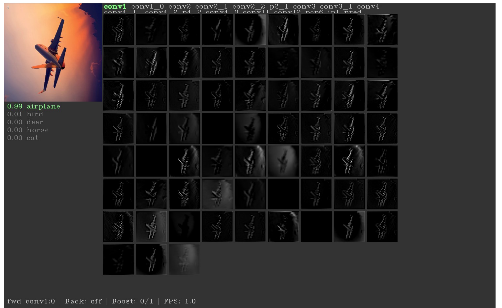

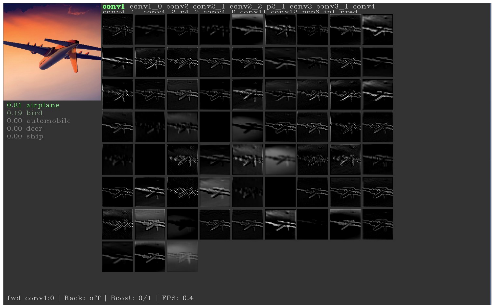

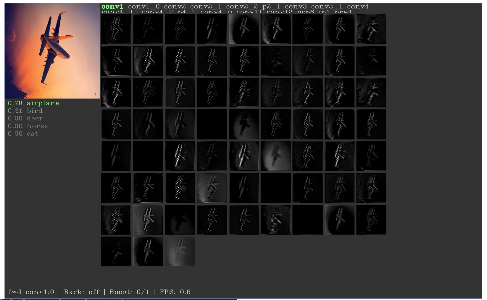

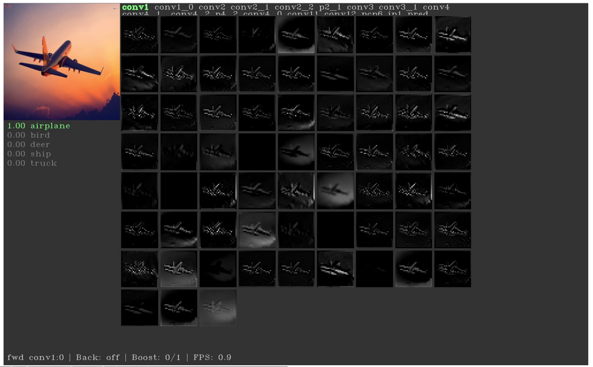

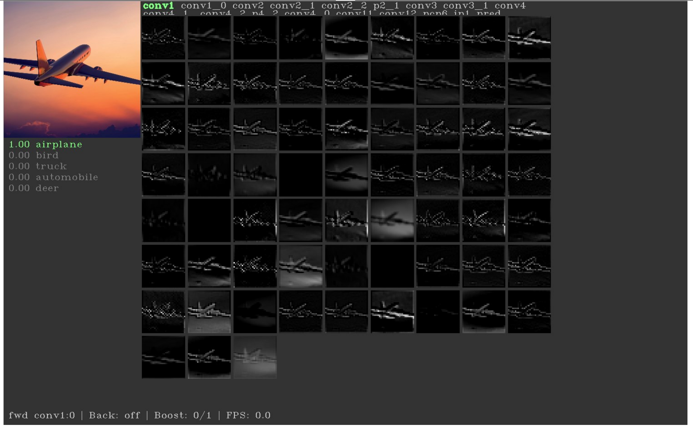

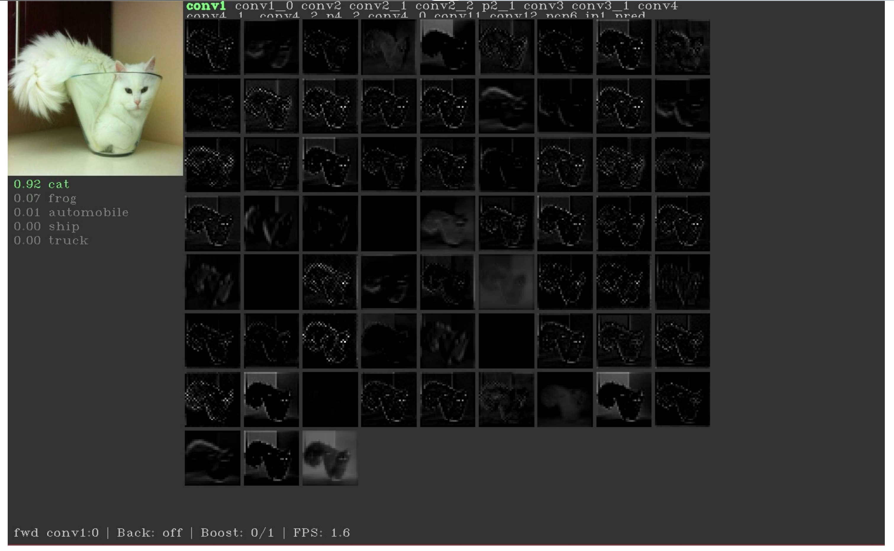

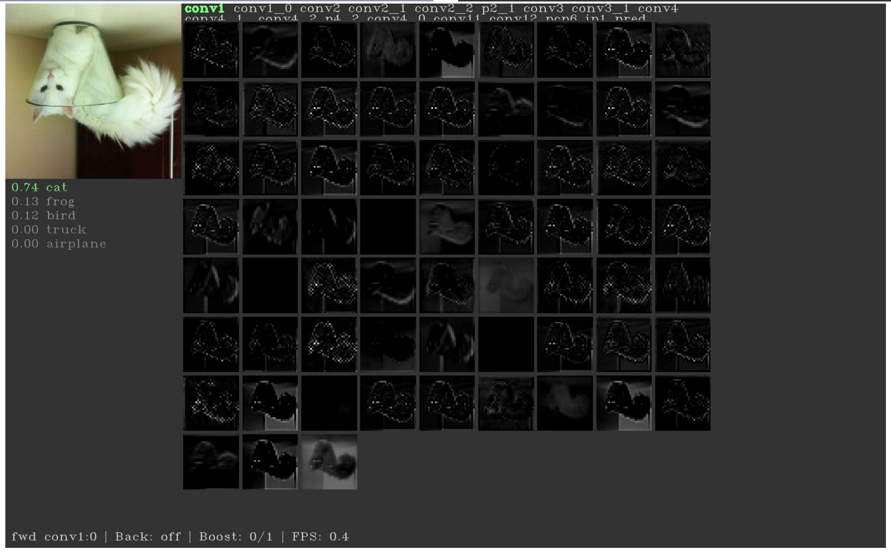

*图S6：健壮的特征可以被直接学习，这样网络就有非常好的泛化能力。*

### F. 最大化利用性能

表S1中展示了使用不同大小内核所表现的性能和所需的时间。3x3的表现是最好的。

|      网络特性       |  3x3  |  5x5  |  7x7  |
| :-----------------: | :---: | :---: | :---: |
|  准确度(越高越好)   | 92.14 | 90.99 | 89.22 |
| 耗时(min，越少越好) | 41.32 | 45.29 | 64.52 |

*表S1：使用Caffe框架，cuDNN v6，网络的参数数量为1.6M个，并且深度相同。*

### G. 保存关联性

在CIFAR 10上对SqueezeNet 和SimpNet(简化版，只是用3x3卷积层)进行对比。

## S2.  网络结构实验

这里不同种类的网络，都是基于SimpNet进行的修改。这里我们会给出一些与主论文不同的实验报告，测试的每种架构使用的是一般性配置。完整的实现细节，可以在我们的Github库中看到。下文中，$C_x\{y\}$表示一个有x个特征图的卷积，重复了y次。当y=1时，就不用大括号了。我们接下来就用这种方式对实验结果进行展示。

### A. 逐步扩展

配置为表2所示，结果为表S3所示。

| 网络 | 参数数量 |                             配置                             |
| :--: | :------: | :----------------------------------------------------------: |
| 8层  |   300K   |        $C_{41}, C_{43}, C_{70}\{4\}, C_{85}, C_{90}$         |
| 9层  |   300K   |      $C_{44}\{2\}, C_{57}\{4\}, C_{75}, C_{85}, C_{96}$      |
| 10层 |   300K   |      $C_{40}\{3\}, C_{55}\{4\}, C_{75}, C_{85}, C_{95}$      |
| 13层 |   300K   | $C_{30}, C_{40}\{3\}, C_{50}\{5\}, C_{58}\{2\}, C_{70}, C_{90}$ |

*表S3：逐步扩展：网络配置*

### B. 最小分配

配置为表3所示，结果为表S4所示。

| 网络 | 参数 |                   配置                    |
| :--: | :--: | :---------------------------------------: |
| 6层  | 1.1M | $C_{64}\{2\}, C_{128}\{2\}, C_{256}\{2\}$ |
| 10层 | 570K |    $C_{32}, C_{48}\{2\}, C_{96}\{7\}$     |

*表S4：最小分配：网络配置*

### C. 平衡分布

配置为表4所示，结果为表S5所示。

|   网络   | 参数 |                             配置                             |
| :------: | :--: | :----------------------------------------------------------: |
| 10层，WE |  8M  | $C_{64}, C_{128}\{2\}, C_{256}\{3\}, C_{384}\{2\},C_{512}\{2\}$ |
| 10层，BW |  8M  |      $C_{150}, C_{200}\{2\}, C_{300}\{5\},C_{512}\{2\}$      |
| 13层，WE | 128K |     $C_{19}, C_{16}\{7\}, C_{32}\{3\}, C_{252},C_{300}$      |
| 13层，BW | 128K |       $C_{19}, C_{25}\{7\}, C_{56}\{3\},C_{110}\{2\}$        |

*表S5：平衡分布：网络配置。WE表示宽输出，BW表示平衡宽度。*

### D. 最大化利用信息

配置为表5所示，结果为表S6所示。

| 网络 | 参数 | 配置                                                         |
| ---- | ---- | ------------------------------------------------------------ |
| Arch | 53K  | $C_{6}, C_{12}\{3\}, C_{19}\{5\}, C_{28}\{2\}, C_{35}, C_{43}$ |

*表S6：最大化利用信息：网络配置。*

### E. 保存关联性

配置为表6所示，结果为表S7所示。

表S8中包含了与表7相关配置信息。

| 内核大小 | 参数 |                       配置                       |
| :------: | :--: | :----------------------------------------------: |
|   3x3    | 300K |  $C_{41}, C_{43}, C_{70}\{4\}, C_{85}, C_{90}$   |
|   3x3    | 1.6M | $C_{66}, C_{96}, C_{128}\{4\}, C_{215}, C_{384}$ |
|   5x5    | 1.6M | $C_{53}, C_{55}, C_{90}\{4\}, C_{110}, C_{200}$  |
|  7x7.v1  | 300K |    $C_{20}\{2\}, C_{30}\{4\}, C_{35}, C_{38}$    |
|  7x7.v2  | 300K |  $C_{35}, C_{38}, C_{65}\{4\}, C_{74}, C_{75}$   |
|   7x7    | 1.6M |  $C_{41}, C_{43}, C_{70}\{4\}, C_{85}, C_{90}$   |

表S7：保留相关性：网络配置。

|  内核大小  | 参数 |                             配置                             |
| :--------: | :--: | :----------------------------------------------------------: |
| 1×1.L1 →L3 | 128K |     $C_{21}, C_{32}\{8\}, C_{37}, C_{48},C_{49}, C_{50}$     |
| 2×2.L1 →L3 | 128K |          $C_{20}, C_{32}\{8\}, C_{38}, C_{46}\{3\}$          |
| 1×1.L4 →L8 | 128K |   $C_{20}, C_{32}\{2\}, C_{46}\{6\}, C_{48}\{3\}, C_{49}$    |
| 2×2.L4 →L8 | 128K | $C_{20}, C_{32}, C_{33}, C_{41}\{2\}, C_{40}\{4\}, C_{41}, C_{43}, C_{44}, C_{45}$ |
|  1×1.End   | 128K |   $C_{19}, C_{25}\{7\}, C_{64}, C_{53}\{2\}, C_{108}\{2\}$   |
|  3×3.End   | 128K |      $C_{19}, C_{25}\{7\}, C_{26}, C_{51}\{3\},C_{52}$       |
|  2×2.End   | 128K |              $C_{19}, C_{257}, C_{91}, C_{922}$              |
|  3×3.End   | 128K |                  $C_{20}, C_{257}, C_{643}$                  |

*表S8：保留相关性2：网络配置。*

| Arch1  | Arch2       | Arch3  | Arch4  | Arch5  |
| ------ | ----------- | ------ | ------ | ------ |
| Conv1  | Conv1       | Conv1  | Conv1  | Conv1  |
| Conv2  | Conv2       | Conv2  | Conv2  | Conv2  |
| Conv3  | Conv3       | Conv3  | Conv3  | Conv3  |
| Conv4  | Conv4       | Conv4  | Conv4  | Conv4  |
| Conv5  | Pool        | Conv5  | Conv5  | Conv5  |
| Pool   | Conv5       | Pool   | Pool   | Pool   |
| Conv6  | Conv6       | Conv6  | Conv6  | Conv6  |
| Conv7  | Conv7       | Conv7  | Conv7  | Conv7  |
| Conv8  | Pool        | Conv8  | Conv8  | Conv8  |
| Conv9  | Conv8       | Conv9  | Conv9  | Conv9  |
| Conv10 | Conv9       | Conv10 | Conv10 | Pool   |
| Pool   | Pool        | Pool   | Pool   | Conv10 |
| Conv11 | Conv10      | Conv11 | Conv11 | Conv11 |
| Conv12 | Conv11(1x1) | Conv12 | Conv12 | Conv12 |
| Conv13 | Conv12(1x1) | Conv13 | Conv13 | Conv13 |
| GP     | Pool        | GP     | GP     | GP     |
|        | Conv13      |        |        |        |
|        | Pool        |        |        |        |

*表S9：使用不同的基础架构。使用的内核都是3x3的，如果有使用其他方法会在括号内注明，这里GP表示全局池化。*